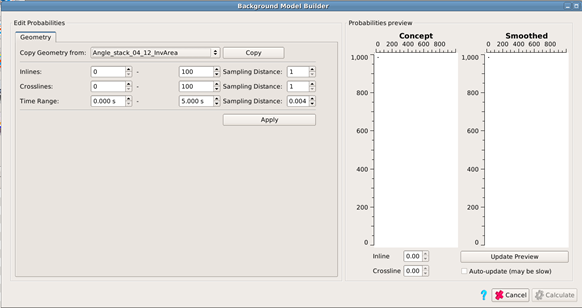
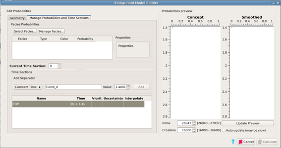
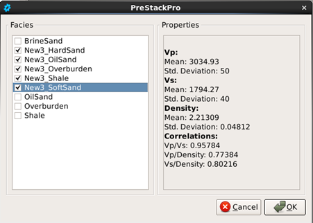
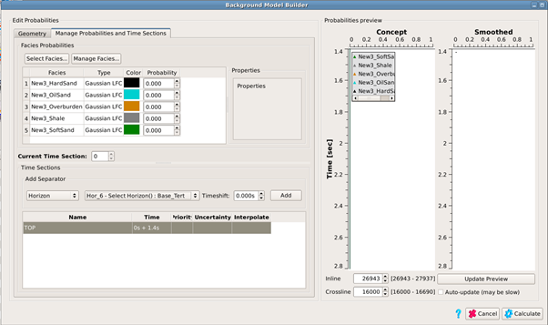
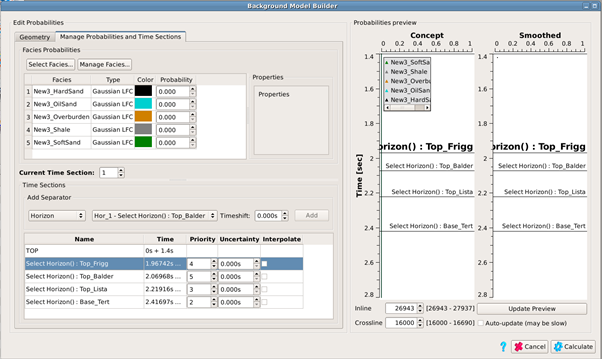
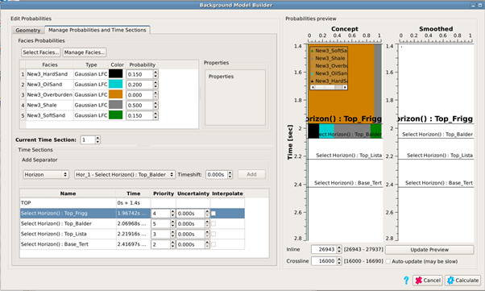

# PCube Background Model Builder

The PCube Background Model Builder creates a prior model required to run the PCube Inversion \(next section\). The input is a set of litho-facies and a number of horizons. The output is a prior probability volume \(the size of a stack\) for each of the litho-facies.

Each litho-facies is intended to correspond to a distinct litho-class in a $$Vp-Vs-\rho$$ cross plot. Typically, they come from wells in the inversion area. This work is done in a rock physics software package, and the results imported into Pre-Stack Pro. The logs should be QC’d and preconditioned carefully, then elastic properties in the zones of interest are cross-plotted. This allows identification of distinct classes. In the example used in this manual, there were four classes defined for the reservoir interval, shale, hard brine sand, soft brine sand, and hydrocarbon sand. The overburden was very soft and homogeneous, and therefore a single overburden class was used. Besides using lithology curves for the facies identification, cut-offs were applied for porosity and saturation. Finally, the well data for each separate facies must be exported from the rock physics package in a separate ascii file, with three columns $$Vp (m/s)$$, $$Vs (m/s)$$ and density $$(g/cm^3)$$ and no file header. These files are imported into Pre-Stack Pro \([Facies Manager](../../utilities_and_setting/manage_facies.md)\).

It is generally recommended that 3-5 horizons are used to build the prior model \(for a 1 second inversion window\). They should cover the full inversion area without having holes, and as far as possible they should not be too close together. They should also be spatially smoothed. Many of the artifacts seen in inversion results are due to problems with the horizons, and therefore it is worthwhile spending a lot of time on horizon QC. Check whether they cross, whether they have holes, and whether there are cycle skips, everywhere within the inversion area before importing them into Pre-Stack Pro.

The first step in creating a prior model is defining the geometry. Typically, this is the same as the inversion area, although it may be bigger. Select a data set with the desired geometry from the drop-down list, and click the Copy button. The parameters may be edited if a subset is required. Then click the Apply button. This sets the geometry for the prior model, and the Manage Probabilities and Time Sections tab becomes visible.

The facies and horizons must be loaded into the GUI to create the model. To load facies into the project, click the Manage Facies button. This brings up the [Facies Manager](../../utilities_and_setting/manage_facies.md).

If the facies are already loaded in the project, Select Facies brings up a list of available litho-classes. Tick on the desired selection and press OK.

The required horizons for the model must be loaded in the volume pool. For each one, select it from the drop down list and click Add.

The Priority parameter sets which horizon is used if two horizons cross. The numbers are rankings, so the horizon with a lower priority value \(higher rank\) is used.

The Uncertainty parameter is supplied to allow for uncertainty in horizon picking. For good horizons, it should be related to the width of the main lobe of the wavelet. If horizons are noisy or hard to track, the uncertainty should be increased to allow for possible jumps or cycle skipping. However, this parameter should not be used as a substitute for careful horizon QC first. The effect of the parameter is to smooth the prior model across the horizons, with the smoothing length determined by the uncertainty.

Once horizons are loaded, prior probabilities may be assigned to each interval between horizons. Highlight a horizon by clicking on it, then set the prior probability for each facies in the upper box for the interval between the highlighted horizon and the next one down. The probabilities may be obtained by taking volume averages for each class over the intervals in your rock physics software. It is normal that all the probabilities in the interval should sum to one, but if this is not the case the software will rescale them.

Once all of the layer probabilities are defined, press the Update Preview button. This will show the original and the smoothed models at the given inline, crossline location. The uncertainties may be adjusted to give the desired amount of vertical smoothing.

Finally press the Calculate button. A prior probability volume for each facies class will appear in the volume pool, and these can be visualized like any stack volume. The volumes are not saved to the project and it is recommended to right-click on one of them in the volume pool and select the Save Volume to Project option. All of them can then be saved by selecting Yes to the “Save All Siblings” pop-up box.

