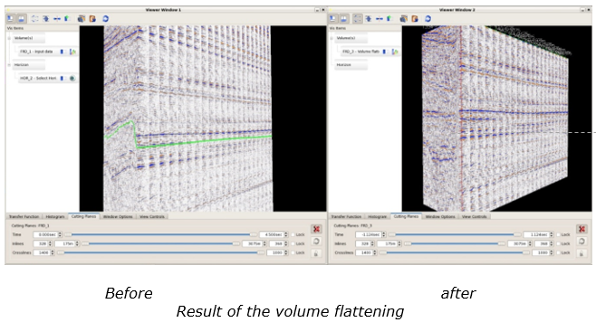

# Volume flattening and unflattening

**Input selection:**

The sculpting algorithm needs the seismic input and the horizon to have the same domain \(either both in time or both in depth\).

The input can be stack or pre-stack, angles or offset data.

**Time window:**

**Time/depth less:** refer to the time/depth shift up from the horizon. Data within this interval are kept.

**Time greater:** refer to the time/depth shift down from the horizon. Data within this interval are kept.

**Time shift:** This parameter refers to a global shift of the sculpted data compare to the original horizon. If time shift value is positive, the shift is done downward if the value is negative, the shift is upward.

As a result, a new volume is created, with slices representing a shift from the horizon. The volume is centered to zero time.

Thus, the existing cutting planes can be used to browse through that volume and see the samples with respect to the given horizon.

