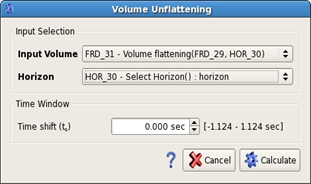

# Volume unflattening

**Volume Unflatten** provides an easy way to reverse the volume flattening after processing has been done. When used together in a workflow, Volume Flatten and Unflatten allow processing to be applied within specific stratigraphic intervals, rather than to the entire time.

_Volume unflattening option_

