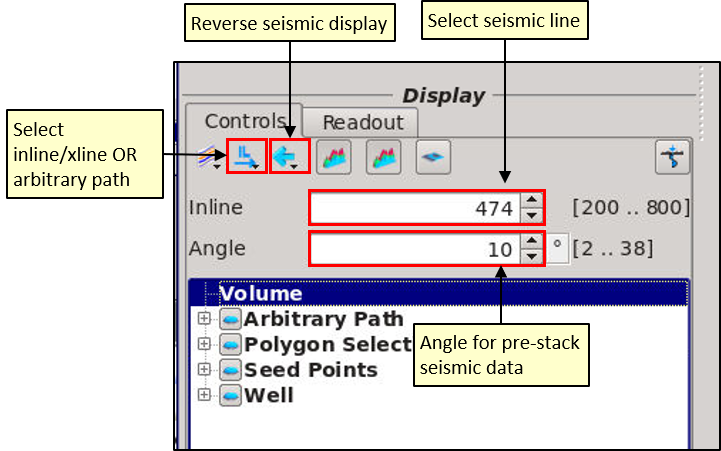

# Horizon Toolkit

The horizon toolkit is designed for creating 3D Autotracked Horizons, gridding horizons and editing both. Preview panels display the horizons/grids on a seismic panel and in a map window for QC purposes. Horizon Tools can be applied to pre-existing horizon**s** or used to generate new, 3D autotracked horizons. It also links with the Manual Horizon window for manual editing of horizons/grids

The horizon toolkit also has the ability to extend stacked horizons to pre-stack data by snapping and tracking the horizons onto gathers**,** gridding functions, editing functions including  de-spiking algorithms.

To open up the horizon toolkit go to: **Interpretation-Processing** → **Horizon Tool**

**Horizon Tools** contains two preview panels: a Seismic Preview Panel and a Map Preview Panel. These automatically update as horizons/grids are generated. These preview panels can be resized by dragging the dashed line between them.

The left-hand side of the window contains Data Trees and the function buttons.

Panels can be zoomed into using the mouse-wheel inside the panel or on one of the axis for the Seismic Panel.

Histograms are displayed for the seismic data and whichever horizon/grid is displayed in the Map panel. To change either hover the cursor over the histogram, scroll the mouse wheel to change the  range of the colour bar, or use right-mouse click to select a different colour scale. Histograms can be toggled on/off using the icon on the left. 

Well data, polygons, arbitrary paths and seed points can be toggled on.

**Select a seismic volume** that has been pre-loaded into the Data Pool. This can be time or depth, pre-stack or stack data. For pre-stack seismic select the angle to stack on the fly from the Data Tree. 

Seismic lines are selected by either: Typing/scrolling in the box on the left-hand panel OR Double clicking on the Map. For pre-stack seismic select the angle to stack to on the fly.

Behind the Controls Tab is a Readout Tab, displaying the data values for the cursor as it moves over the Seismic Panel.

As horizons or grids are loaded or created they are added to the Data Tree. They can be toggled on via the "eyes" to view simultaneously on the Seismic Panel. Their colour can be changed by clicking on the colour-bar next to their name.

## Arbitrary Paths

Right click on the Map preview panel &gt; Create Arbitrary Path &gt; Give the path a name. The first point is added to the Map, move it as require, add additional points with **CTRL** and **Right Click**. Right click and Save changes. 

Select Arbitrary Path for display from the icon and drop-down menu in the Data Tree. Note seeds for autotracking can be placed on arbitrary paths or inlines/crosslines.

## Attributes

Attributes are automatically calculated on the fly for any horizon or grid displayed in the Map Preview panel. They are not saved to the project when the horizon/grid is saved. Go to Create Maps to generate attribute maps to save into the project.

Attributes are selected from the pull-down menu on the top right-hand corner:

* Amplitude
* Envelope
* Instantaneous Phase
* Max. Sample in a Window\*
* Min. Sample in a Window\*
* Max. Curvature
* Min. Curvature
* Dip
* Azimuth
* Z Deviation \(vertical deviation from the average of the horizon\)\*

\*Windows are defined in Attribute Parameters Controls \(icon next to attribute pull--down menu\)

Attributes are used to QC horizons and grids, and can also be used to edit horizons/grids. See **Remove Selection** in **Horizon Tools**.

## Saving

Horizons and Grids are not automatically saved, the user must choose to save to the project. Click on the Save icon in the Horizon Tool Menu to save the highlighted horizon/grid into the project. 

If a horizon or grid requires manual editing, it can be sent to the Manual Horizon Picking tool. See Manual Horizon Picking chapter.

