# AutoTrack in Stack

This application is a **seed point based** automatic horizon tracker.

Seeds can be input on any vertical section in Pre-Stack Pro, or within Horizon Tools using the preview panel. Pre-stack seismic data loaded into Horizon Tools is automatically seismic stacked on the fly, \(the stack angle controlled in the data tree\) with autotracked horizons being tracked on the stacked volume.

To create a Seed Point Set place the cursor on the Seismic Panel, and select right-mouse click &gt; Create seed points &gt; name the set. This set is now added to the Data Tree. A seed is automatically created, drag it to the location you want. Right Click &gt; Save changes.

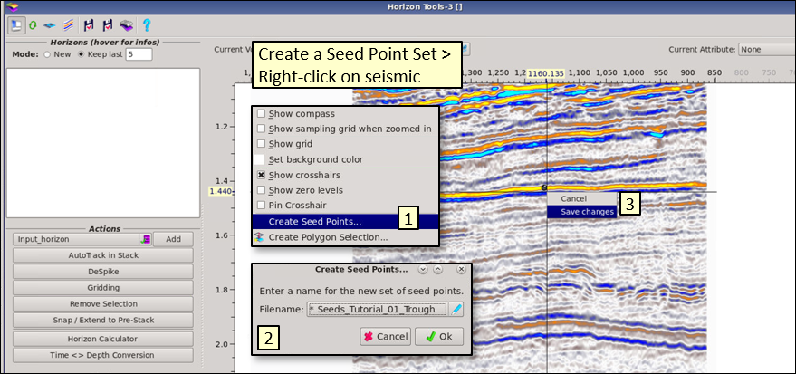

Click on **Autotrack in Stack.**

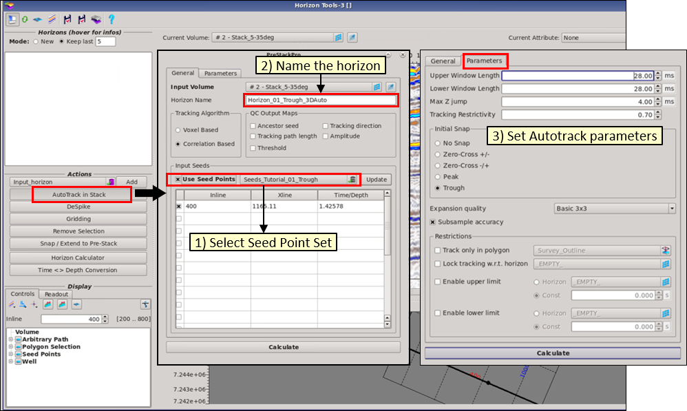

1\) ****select the seed point set, 2\) give the horizon a name, 3\) click on Parameters Tab and select the tracking parameters \(e.g. Trough\). Press Calculate**. The autotracked horizon will automatically appear in the Map preview panel, on the Seismic panel and will be listed in the Data Tree.** By default, up to 5 horizons will be kept in the Data Tree \(user can increase/decrease this number\). Each new autotracked horizon will be added to the list, without overwriting previous versions.

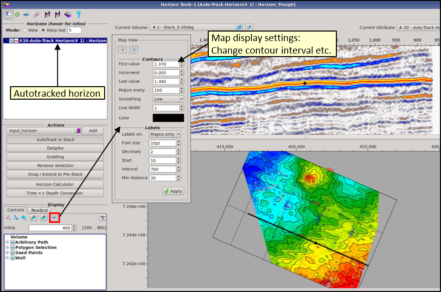

To add multiple seeds to use in the autotracker: find the seed-point set in the Data Tree &gt; right-click on the seed point set and select **edit**. You can now add seeds by holding **CTRL** and clicking on the Seismic panel. Seeds can also be deleted on the seismic panel, edited and moved, or deleted via the Map panel \(right-click on a seed\). To save the changes to the seed-point set, right-click and choose **Save Changes**.

Click on Autotrack in Stack and rerun the autotrack. The new seeds will be listed in the tracking parameters.

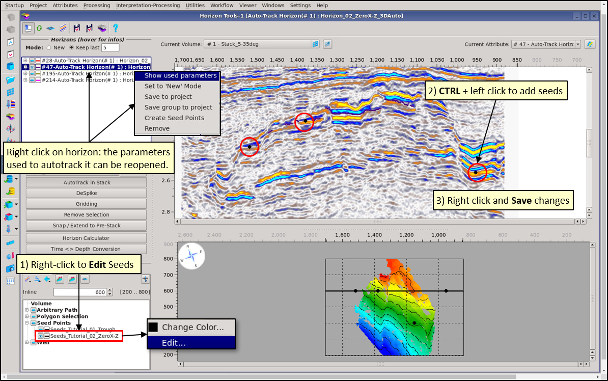

## Autotrack Parameters

This Auto-Tracker allows snap to and track of seismic trace peaks, troughs and zero-crossings; but is not designed for following constant values in non-seismic volumes such as PCube $$V_p$$, $$V_s$$, density output data.

For time data, times are picked either to nearest sample time or to $$\frac{1}{4}$$ sample rate if the subsample option is selected.

Control of the tracker’s picking of an event is by:

1. The choice of voxel or correlation method: Single voxel tracking is faster and can be better at staying on a peak or trough but not necessarily the right one. Correlation over a time window is slower, can be better at following the right target event if stronger parallel events can guide the tracker, but aren’t always on the event peak or trough if a nearby dominant event is not quite parallel.
2. Tracking window length, which does not have to be symmetrical about the seed point. This can be a powerful method of controlling autotracked horizons and is  dependent on the type of event being tracked \(e.g. unconformity\) and the quality of the seismic data.
3. Max Z jump allowed between picks.
4. A tracking restrictive value \( 0 is low, 1 is high \).

Control of spatial growing, or the “expansion quality” of horizons; away from input seed points is from:

1. Seed point placing, 
2. 2D tiles, 3x3 or 5x5 within which all traces must be trackable from the latest seed trace
3. Map polygons, inclusive and exclusive.

## QC Maps and Child-Parent Paths

Additional QC maps can be toggled on for autotracking:

* Ancestor Seed
* Tracking Path Length
* Threshold
* Tracking Direction
* Amplitude

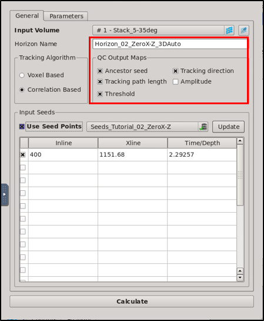

To display these attributes, open a **synced Map Window** by clicking on the Map icon in the top left-hand corner of Horizon Tools. 

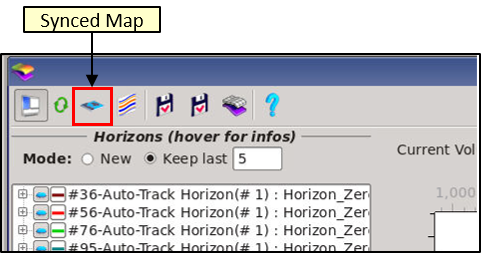

A Map window opens up with the QC maps listed in the Data Tree.

### QC Maps

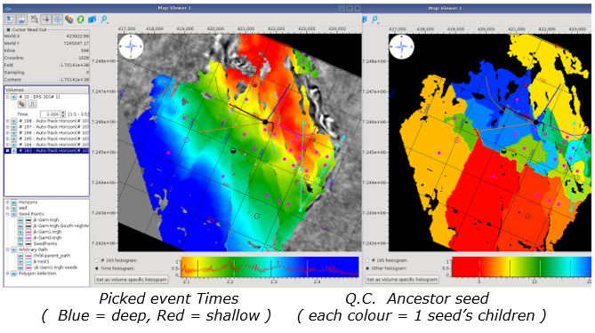

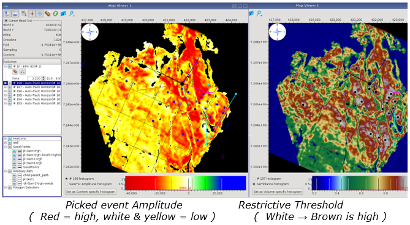

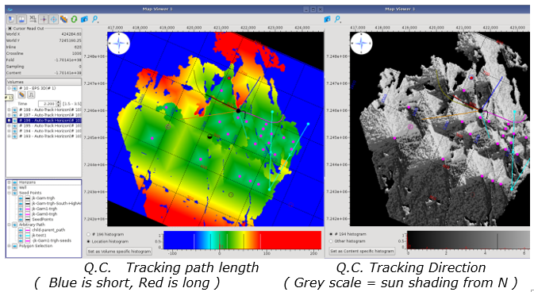

### Child-Parent Paths

The child-parent path is the tracking path from the seed to the chosen point on the horizon. Right mouse click to select from the menu OR use the hotkeys as detailed below

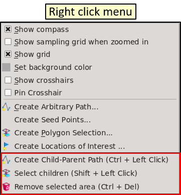

**To delete using Child-Parent Paths:**

1. Open a synced Map window 
2. Place cursor at specific point on the autotracked horizon, then CTRL and left click to show the path. 
3. Move cursor along the path, and press Shift and left click to highlight the children from that point onwards 
4. Use CTRL + DEL to remove the highlighted part of the horizon.

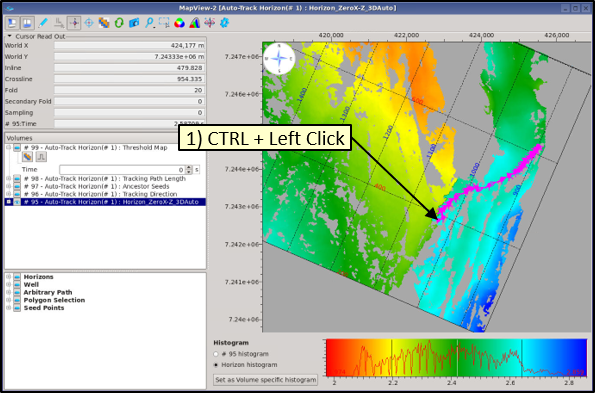

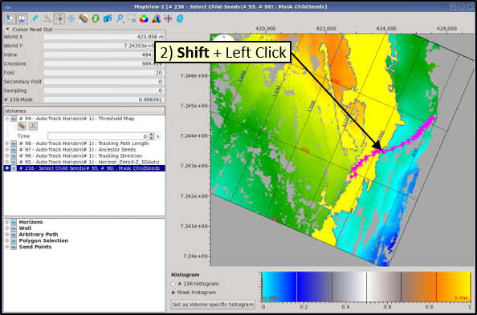

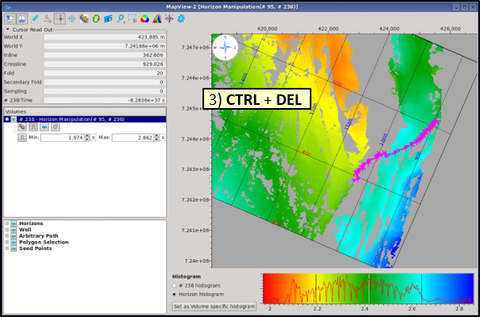

**To view the child-parent path:**

1. Open a synced Map window 
2. Place cursor at specific point on the autotracked horizon, then CTRL and left click to show the path. 
3. In Horizon Tools, change the Seismic panel to Arbitrary Path
4. Select child-parent path from the list.

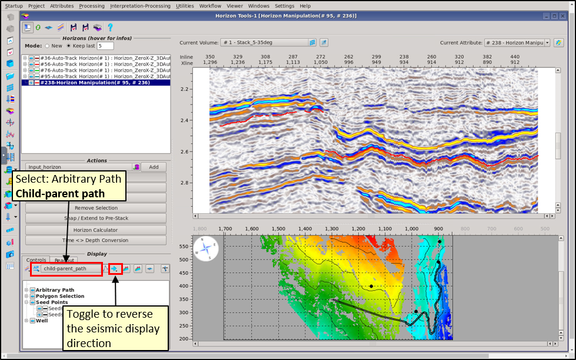

**To extend/edit the Child-Parent path:**

1. Right click on the Child-Parent path and select Edit Path. 
2. Drag the end points of the path to extend it Right click and Save changes
3. The Arbitrary Child-Parent Path in the preview panel will update 

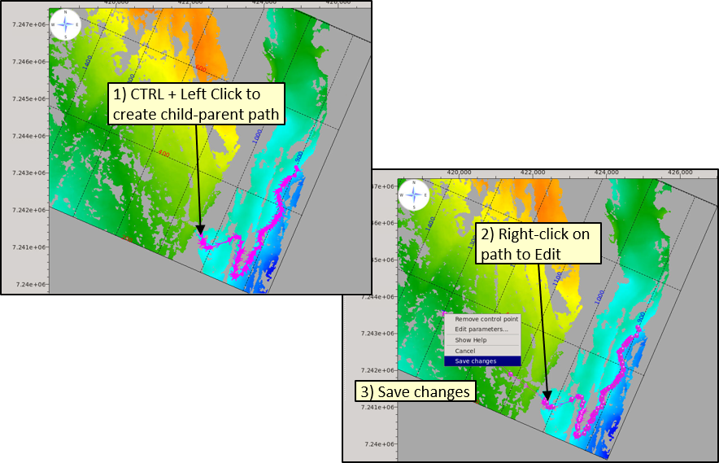

**Tracking workflow ideas:**

1\) Always use a minimum of seed points, this allows the tracker, freedom to work. Inputting more points than necessary, takes time and increases the chance of the interpreter making a mistake by misplacing a seed on a doublet or across a fault for example. It also makes “clean up” harder as tracking paths become shorter and picking zones shrink as more and more points compete with one another to pick any particular trace.

2\) Start with 1 point or just a few points / fault block or good seismic zone. Add extra, single seeds, only where required, because the resulting map has holes or miss-picks. These are input best using arbitrary seismic lines.

3\) Keep rerunning the tracking calculation each time new seeds are added until a majority of the area has been tracked and areas left can be filled in by gridding or manual picking.

4\) Only then undertake a cleanup operation. Using delete children or map polygon delete and fix the result after “clean up” in the interactive result list, by making it NEW and in the project, by saving it to disk.

