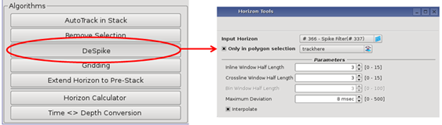
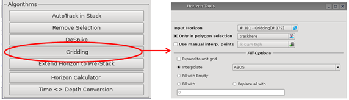
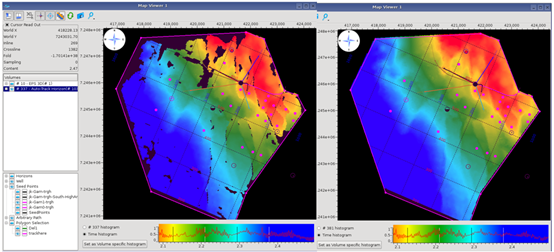

# Despike and Gridding

Despike and Gridding can “clean up” holes left by the AutoTrack application.

Despike run to remove any picks that deviate &gt; 8 msec, after a 7x7x7 filtering

Gridding run to “fill in” holes left unpicked.

_Despike and ABOS gridding, within an inclusive polygon._

