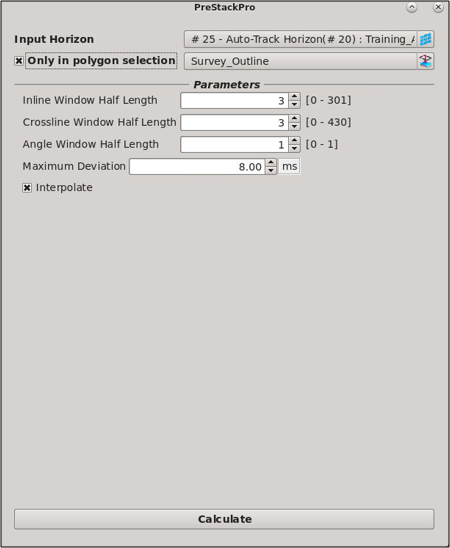

# DeSpike

Despike can be used on horizons OR grids to smooth the surface. Running despike will create a new horizon in the Data Tree \(without overwriting input surface\). Despike can be applied within a polygon.

Select the surface for despiking, options are to change the inline/xline window range and the maximum Z deviation.

