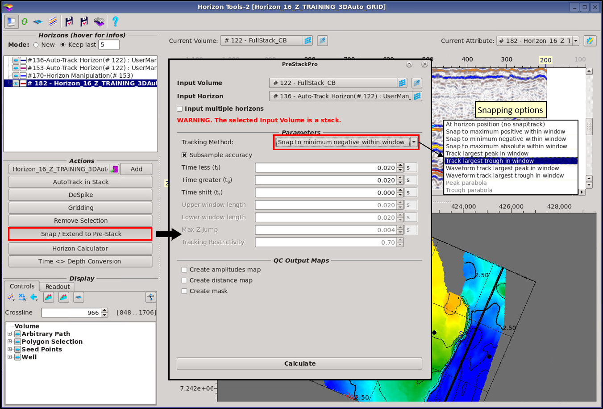
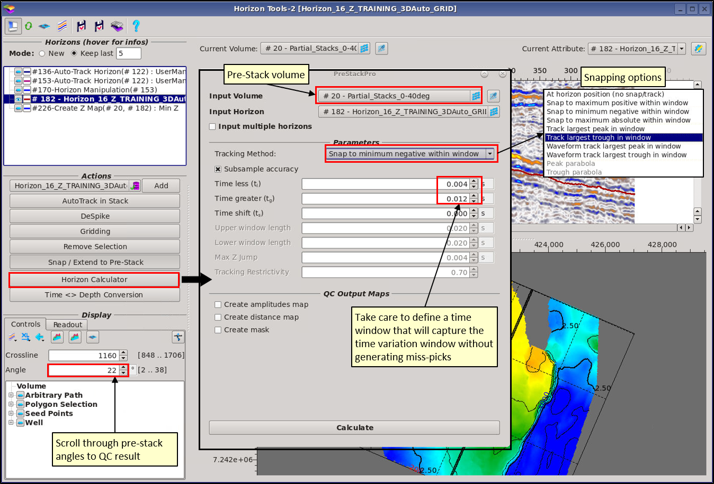

# Snap / Extend to Pre-Stack

Horizons and/or Grids can be snapped to stack OR pre-stack seismic data using the Snap/Extend to Pre-Stack function.

## Snapping to Stacked seismic data: 

Select the horizon/grid you wish to snap to the seismic volume

Select the snapping options as listed above in the figure. The snapping window is defined in the window, and can be used to shift the surface.

The resulting surface will not overwrite the input surface, it will be added to the Data Tree.

## Extend to Pre-Stack

In general, pre-stack data will contain structural information and lateral variations that cannot not described by homogeneous post-stack horizons. Therefore, it can be invaluable to create pre-stack horizons for AVO analysis.

Select a pre-stack seismic volume to extend the surface to, select the Tracking Method and press Calculate.

For more advanced tracking, there is the option to track using multiple horizons based on the binning.

It is possible to create several QC outputs.

## **The available tracking methods**

The **Snap to** method will take the post-stack horizon as input and carry out a scan of each gather-trace for the defined input volume. It will the snap the horizon to the largest positive, negative or absolute value within the user defined window.

The **Track** method will follow the peak or trough across the gather. Here, the user defined window is applied trace by trace \(rather than per gather in the snap method\). This allows more room for deviation from the stacked horizon. For example, it can be useful to track upwards residual moveout on gathers. However, caution should be taken if the event is not well defined.

The **Waveform Track** method consolidates the snap and track methods. It will follow the local minima or maxima across the gather for the user defined windows. Some snapping is permitted with the max Z Jump parameter. The restrictively constraint limits the tracking based on quality of the picks. Large values are restrictive, and may curtail the tracking. Small values are more open, but less reliable.

Irrespective of the algorithm used, it may be necessary to apply some smoothing on the derived pre-stack horizons. This can be carried out by using the **DeSpike** function.

