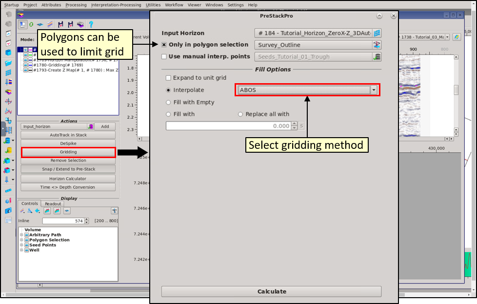

# Gridding

Gridding can be applied to horizons OR grids. Select the horizon/grid as input, choose the gridding method then calculate.

Toggle on polygon limit as required.

The new grid is added to the data tree. Multiple horizons/grids can be toggled ON to display them on the seismic line for QC purposes.

Gridding methods:

* **Inverse Distance Weighting,** a weighted average interpolator which cab be sensitive to clustering and the presence of outliers. Restricted to the input data range and will not extrapolate beyond it.
* **Moving Average,** extracts intermediate-scale trends and variations from large, noisy data sets and is useful for generating grids from large, regularly spaced data sets.
* **ABOS**  \(**A**pproximation / interpolation **B**ased **O**n **S**moothing\) based on numerical tensioning and smoothing which are performed so that elements of matrix, which represents surface z-values at nodes of a regular rectangular grid, are repeatedly replaced by the weighted average of selected surrounding elements. Extends to the edge of the survey unless restricted by a polygon.

