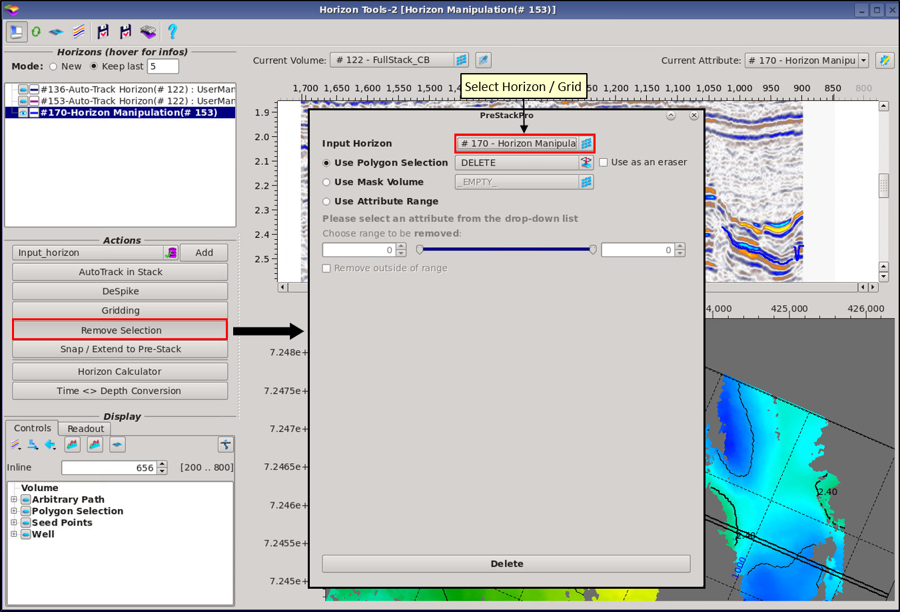
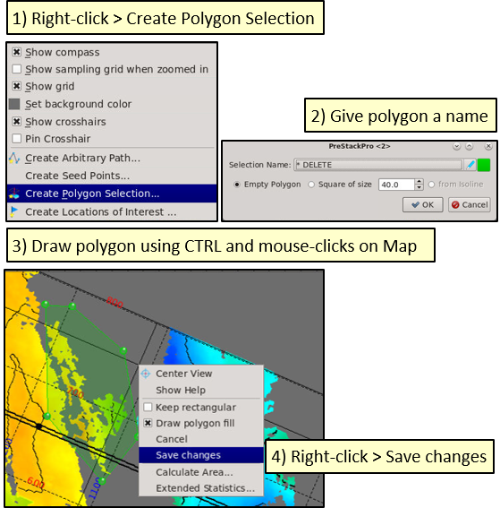
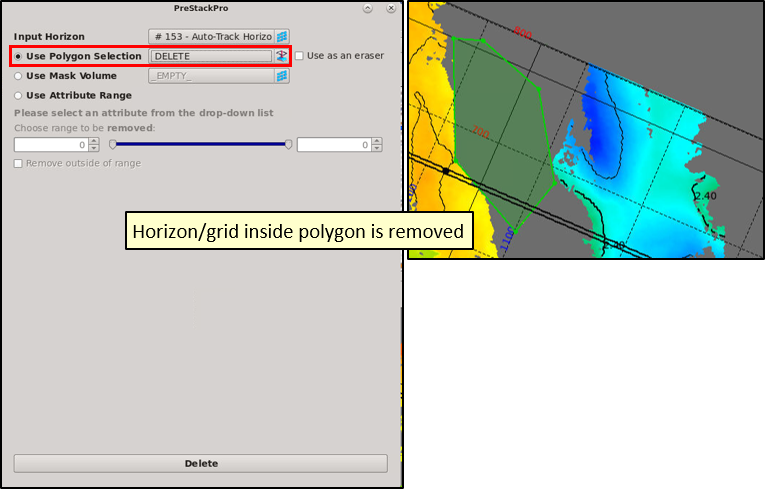
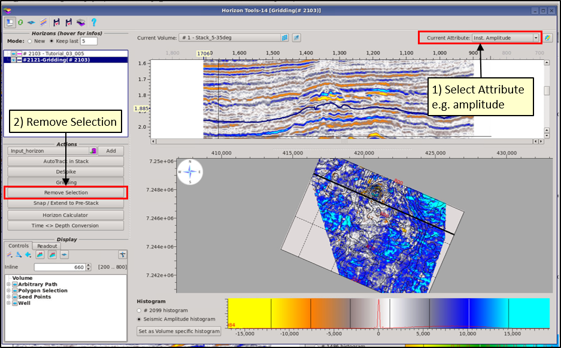
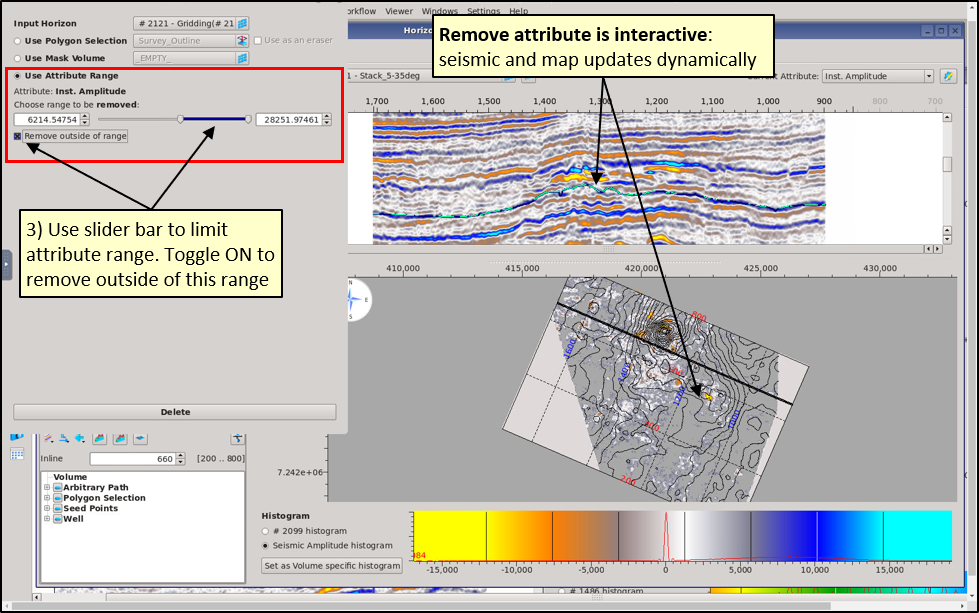

# Remove Selection

**Remove Selection** can be used to remove portions of horizons OR grids. There are three options:

1. Delete using polygons
2. Delete using a predefined Mask Volume
3. Delete using attributes.

## **Polygon Delete**

Use a pre-defined polygon to delete sections of a horizon/grid, OR create a new polygon to use for deletion.

In the Map preview panel, right-mouse click to **Create Polygon Selection**, draw the polygon using **CTRL and left-click**, then right-click to Save the changes.

In Remove Selection &gt; Use Polygon Selection &gt; Select the polygon and press Delete. Toggle on "Use as an eraser" to delete dynamically whilst moving the polygon around the Map.

## Mask Delete

Select a mask volume from the Data Pool and delete. Mask volumes are created in the Cross Plot window, Volume Calculator and Combine Volumes.

## Attribute Delete

The attributes calculated on the fly in the preview panels can be used to remove portions of a horizon OR grid. The resulting surface is added to the Data Tree without overwriting input surface.

1. Select an attribute, e.g. Amplitude
2. Click on **Remove Selection** 
3. Select **Use Attribute Range**, which uses the attribute currently displayed in the Map Preview panel.
4. If required toggle on **remove outside of this range**
5. Press **Delete** 
6. Edited grid is added to the Data Tree \(input grid is not overwritten\). This edited grid can be re-gridded, or sent to the Manual Horizon Picker to infill holes before regridding.

