# Wavelet Management and Display

There are several loading and creation options within the Load/Create wavelets function group:

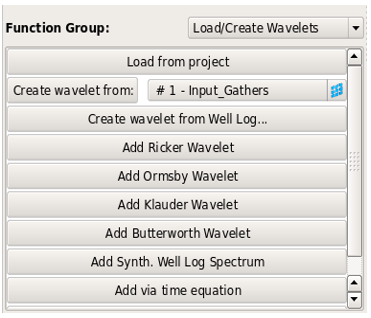

_Function Group - Load/Create Wavelets_

Wavelets can be created in the project from:

* Ascii import via Project → Import data → Import Wavelets
* Saving them to project from the spectral analysis tool
* Saving them to project from a previous run of the wavelet tool.

Every wavelet has a dB reference value.

When creating wavelets, it is important to ensure that they have the correct sample interval. Wavelets cannot be combined \(by convolution, in the various calculators, or by matching\) unless they have the same sample interval. In addition, any operator which will be applied to seismic data must have the same sample interval as the seismic data.

The default sample interval can be set at the top of the wavelet tool:

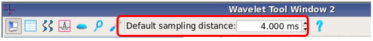

_Setting the Default Sample Interval_

If this value is changed during the session, it will not affect wavelets that have already been loaded into the tool. Any new wavelets will be given the new default sample interval, unless you change the value within the individual GUIs. The exception to this rule is when loading in wavelets from the project. These will keep their original sample interval.

**Loading wavelets**

Wavelets are loaded from the project with the “Load from project” button. Only one wavelet at a time can be selected from the list.

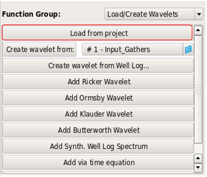 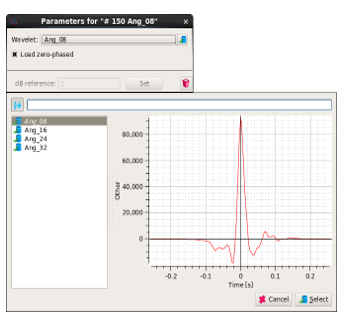

_Load/Create Wavelets - Load from Project_

The first step in many workflows is to zero-phase the extracted spectra. Therefore, the option to “Load zero-phased” is switched on by default. If you need the phase information, then it will be necessary to deselect this check box.

**Creating wavelets**

**Create Wavelet from volume**

A wavelet can be created directly from a whole seismic volume. The area used for input can be inside a Polygon Selection.

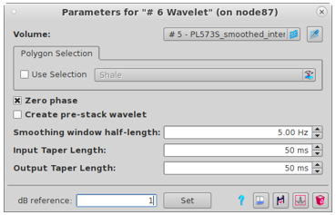

**Create Wavelet from Well Log**

A wavelet can be created from the well logs by selecting the relevant log file from the project. This requires that you import, and select the corresponding time-depth table. The start and end \(MD\) depths used for the spectral analysis can be typed in or defined by the tops.

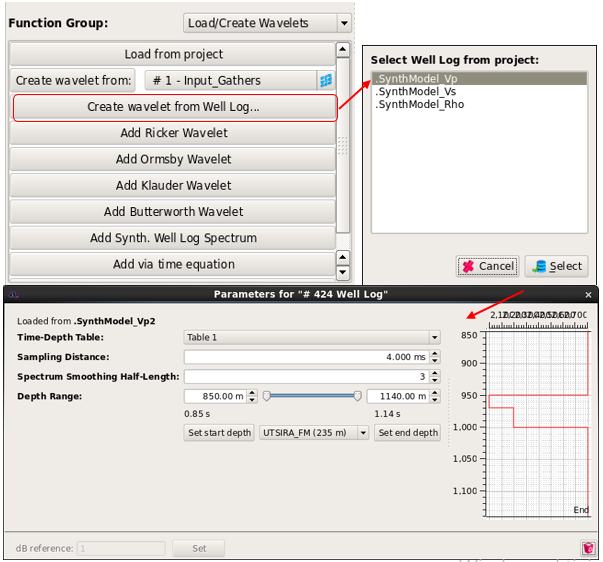

_Load/Create Wavelets - Create Wavelet from Well Log_

**Add Synthetic Wavelet** This function creates a new synthetic wavelet. Several options are possible and detailed below.

**Ricker Wavelet**

Create a zero-phase Ricker wavelet. The time origin, $$t=0$$, is always the centre sample.

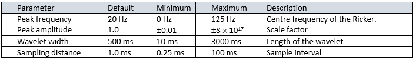

**Ormsby Wavelet**

Creates a zero-phase wavelet with a trapezoidal amplitude spectrum. The time origin, $$t=0$$, is always the center sample. The frequency domain response is defined by 4 corner frequencies with linear interpolation between them. There is no option for a high-cut filter, but this can be obtained by setting the low-cut frequency and the low pass frequency to their minimum values. Equally well, a low-cut filter can be obtained by setting the high-cut and high-pass frequencies to their maximum permitted values.

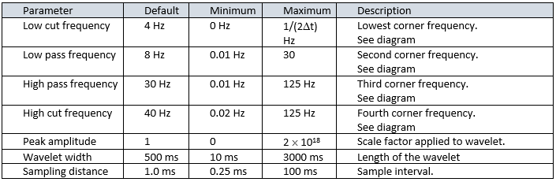

**Klauder Wavelet**

Creates a zero-phase wavelet Klauder wavelet. The time origin, $$t=0$$, is always the center of the wavelet.

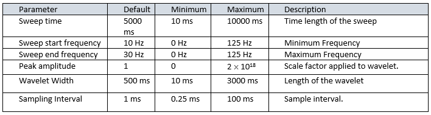

**Butterworth Wavelet**

Creates a zero-phase wavelet with spectrum described by a Butterworth response. The time origin, $$t=0$$, is always the center sample. Options for High-cut, Low-cut and Band-pass responses are available. The order controls the slope of the filter roll-off. The amplitude slope is close to $$3$$ $$n$$ $$dB$$/octave where $$n$$ is the order.

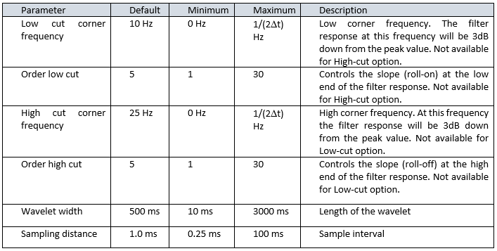

**Gabor Wavelet** Creates a zero-phase wavelet with spectrum described by a Gabor response. The time origin, $$t=0$$, is always the center sample

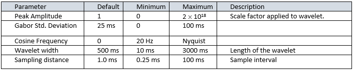

**Gaussian Wavelet** Creates a zero-phase wavelet with spectrum described by a Gaussian distribution. The time origin, $$t=0$$, is always the center sample

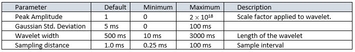

**Spike Wavelet** Creates a zero-phase wavelet with spectrum described by a spike response. The time origin, $$t=0$$, is always the center sample

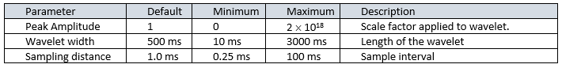

**Add Synth. Well Log Spectrum**

Creates a model well-log spectrum for use in coloured inversion operator design. Typically, such spectra are modelled by a power law in frequency, described by a negative exponent. In this tool, the exponent entered by the user is multiplied by -1. The result is optionally band-limited using a Butterworth filter, then the ends are tapered in time to minimize end-effects.

Because of the slow spectral decay, it is recommended to use very long wavelets. The output is zero-phase and the time origin, $$t=0$$, is the center sample. A scale factor is available to match the amplitude level to that of the seismic data.

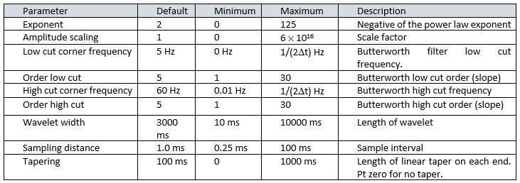

**Add via time equation**

An equation can be specified in the equation editor. The time variable is called ‘$t’. Note that it is always in seconds. Unlike most of the Create functions, it is possible to create a wavelet having its time origin \($$t=0$$\) anywhere, even outside the defined wavelet start-end times.

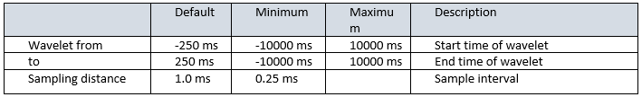

**Add via spectrum equation**

Equations can be specified separately for the amplitude and phase in the equation editor. The frequency variable is called ‘$f’. Note that it is always in Hertz. The time origin of the wavelet, $$t=0$$, is always the center sample.

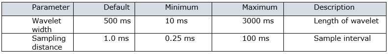

**Saving wavelets to the project**

To save a wavelet to the project, highlight it in the list. Then select the “Save” icon. This brings up a dialogue box allowing you to save the wavelet.

If the wavelet has already been saved \(indicated by an S next to it in the list\), and not modified since the save, then it cannot be saved again. Instead the “Save as” icon will become active, allowing it to be saved with a new name.

If a wavelet has been saved, but is then modified in the wavelet tool \(indicated by an M next to it in the list\), then both “Save” and “Save as” are active. In this case, “Save” overwrites the previously saved version in the project.

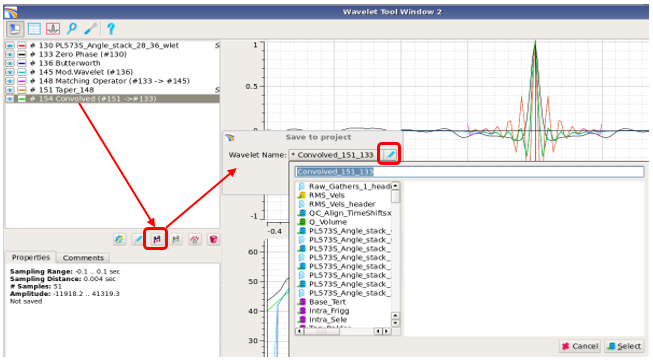

**Save Current Wavelet**

**Applying to volumes**

Wavelets can be applied to a seismic volume directly from the wavelet tool or from the main processing menu using the User-defined Filter module. The wavelet tool cannot be implemented in a batch process, but the User-defined Filter can. In both cases, the wavelet must be saved to the project first.

From the wavelet tool, first save the desired wavelet to the project. Leave it highlighted in the list. Then choose the Other tab, select a seismic volume and press the Convolve: button. This opens the User-defined filter GUI with the desired data set and the desired wavelet selected.

**Display options**

The graphical display areas have the same controls as elsewhere in Pre-Stack Pro. Clicking the right mouse button in the plot area or on a plot axis gives a context menu with various options. In addition, the top menu bar has icons controlling various aspects of the display. Curve colours and visibility are set by icons in the wavelet list. For Pre-Stack Wavelet, the visible angle is set up by a spin box.

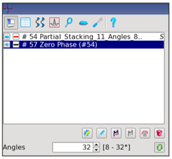

_Display Options_

The **dB reference value** in each function is used to define the zero-level for the amplitude spectrum when plotted on a dB scale. It is only a display parameter and does not affect any calculations. It is useful when displaying several amplitude spectra where the dynamic range of the curves is very different.

For example, suppose one is matching a far seismic stack to a near stack, and typical time-domain amplitudes for both are around 10000. The matching operator will have sample values around 1 in that case. Setting the dB reference value to 10000 for each seismic spectrum, and to 1 for the matching operator, would effectively shift the seismic dB spectra to plot around the 0 dB line instead of values around 40 dB, so they can be compared directly with the operator spectrum.

To change the dB reference value, open the curve parameters, type in a new reference value, and press the Set button:

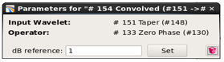

_dB Reference_

**The Menu Bar**

The items in the **Menu Bar** are listed as follows:

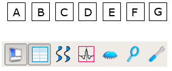

_Menu Bar Icons_

A. Toggles the side bar display off/on, to maximize the area available for graphs B. Toggles on/off a display of the time, sample value pairs for the currently selected wavelet. They cannot be edited C. Displays pre-stack wavelets as a wiggle plot D. Causes the vertical axes to be scaled to fit the currently selected wavelet E. Displays only the selected wavelet F. Zooms out G. Opens the Setup Plots dialogue

The **Setup Plots** dialogue has various display options. They can be changed at any time.

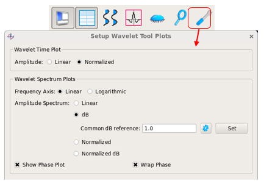

_Setup Plots_

In the time plots, the **Normalized** option gives all displayed wavelets the same peak value of 1. This is useful when they have very different dynamic range.

In Spectrum plots, the frequency axis can be displayed either in linear frequency or in logarithmic frequency. The latter is useful for analyzing power-law spectra, which would be straight lines on a log-log plot.

The amplitude axis can be plotted as linear values or in dB. If they are plotted in dB, a common reference value can be set for all curves. This overrides previous reference values for all curves in the tool.

The Normalized option uses a linear amplitude scale but scales each spectrum to have a peak value of 1.

The Normalized dB scale is equivalent to setting the dB reference of each individual amplitude curve to its maximum value, so that all curves in the amplitude spectrum plot have their maximum at 0 dB.

It is possible to display the phase either wrapped or unwrapped using the Wrap Phase check box. Phase is displayed in degrees.

**The Management Bar**

The items in the **Management Bar** are listed as follows:

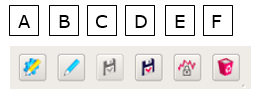

_Menu Bar Icons_

A. Edit current wavelet parameters: brings up the parameter box for the selected wavelet. B. Rename: allows you to rename a wavelet. C. Save current wavelet: brings up a dialogue allowing you to save the wavelet to the project. If the wavelet has been saved already and not modified since it was saved, this icon is greyed out. If it has been saved then modified, this button allows you to overwrite the previously saved version. D. Save current wavelet under a different name: enables you to save the wavelet to the project with a different name from the original saved wavelet. E. Creates a locked wavelet that can be used for comparisons F. Removes the current, selected wavelet from the list.

**Using equations**

Equations can be entered in several places in the wavelet tool. There is a wide range of mathematical operators and functions which can be built into complicated expressions.

They are detailed in the help function:

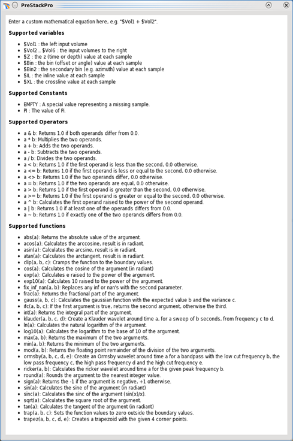

_Supported Equations_

Just as an example, the figure below shows one way to construct a raised cosine taper. In some circumstances, this may be preferable to using the linear ramp taper supplied in the Taper function. 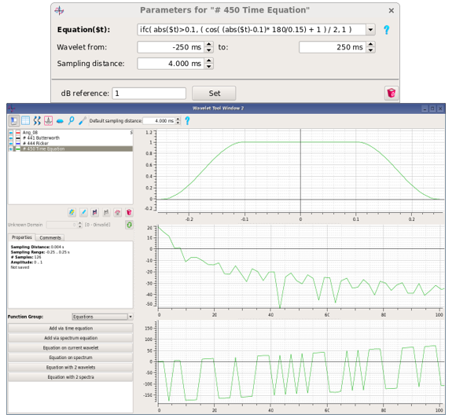

_Cosine Taper Defined by Time Equation_

