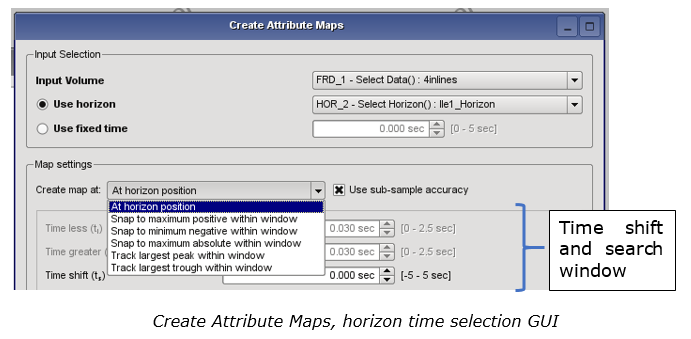

# Create Maps

**Create Maps** in the “Interpretation Processing” menu provides an easy interface to calculate attribute maps on any stacked or pre-stack volume from the Data Pool. Attributes may be calculated using an imported horizon, or from a constant reference time \(useful for flattened volumes\).

Go to **Interpretation-Processing** → **Create Maps**

