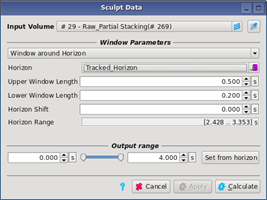
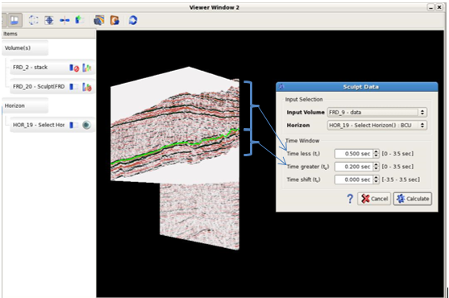
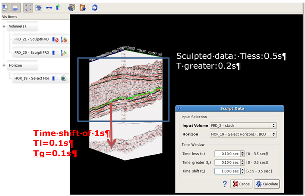

# Sculpt

The sculpt option allows the creation of probe around a horizon of interest. To create a sculpt volume, go to **Interpretation-Processing** → **Sculpt**.

Volumes can be sculpted in a zone of interest. The data will be retained within the window, and set to zero everywhere else.

The input volume needs to be present in the data pool. It can be pre- or post-stack; offset or angle; time or depth. Horizon domains will need to correspond to the seismic. Three options are available:

**Window around Horizon:**

Upper and lower window lengths set the size of the window about a single pre- or post-stack horizon.

**Between 2 Horizons:**

Top and bottom horizons define the window size.

**Between Horizon and Fixed Value:**

One horizon is combined with a fixed time or depth. This option has a check box to specify whether the fixed value is at the top or the bottom.

For all options, reference horizon\(s\) can be shifted relative to the seismic. Positive values move them downwards, whilst negative values shift them up.

The output can be restricted to the maximum limits of the horizons by clicking on the **set from horizon** option.

_Sculpt data: Window around horizon is selected_

**Time window:**

**Upper Window Length:** refer to the time/depth shift up from the horizon. Data within this interval are kept.

**Lower Window Length:** refer to the time/depth shift down from the horizon. Data within this interval are kept.

_Sculpted result: horizon in green_

**Time shift:** This parameter refers to a global shift of the sculpted data compare to the original horizon. If time shift value is positive, the shift is done downward if the value is negative, the shift is down upward.

  
_Positive Time shift_

