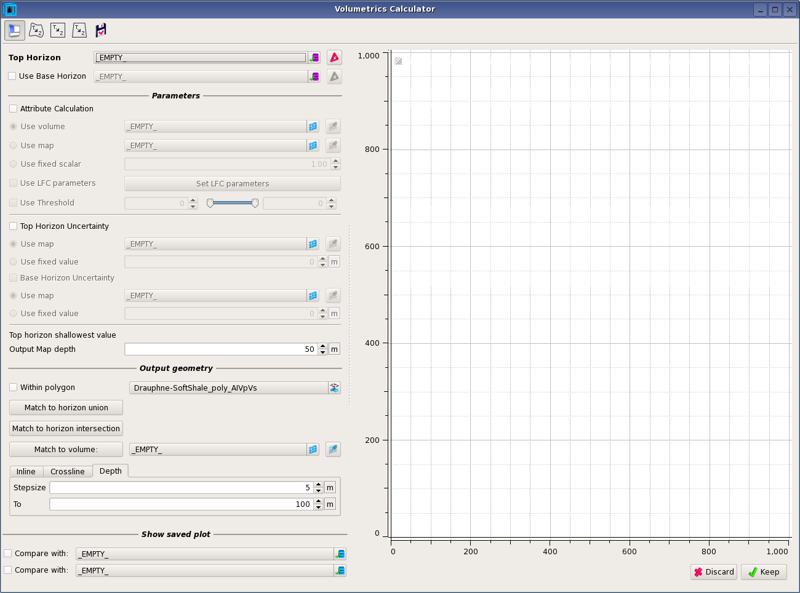

# Volumetrics

**Interpretation-Processing --&gt; Volumetrics Calculator** 

or call from the **Map Viewer**

Volumetrics compute the volume between a horizon defining the top of a layer and either a sliding constant time or a sliding base horizon. It plots the total volume between the fixed top and the moving base as a function of thickness. If called from the Map Viewer a map showing the isopach for the base at a fixed depth below the crest of the top surface. 

The user can multiply the sample volume by an attribute for each sample. For example using a porosity giving the pore volume for that sample. The results is then the total pore volume. There are options to use:

1. a constant attribute, so that all samples in the volume get the same value
2. an attribute map, so that all samples in a trace get the same value, but different traces have different values
3. a volume, so that every sample can have a different value.

The user can also multiply the sample volume by a probability, for example by choosing the sand probability of the output of a [PCube+](pcube+/) run. There are options to select more than one LFC class. In that case, probabilities for the selected LFCs are summed for each sample. The LFC options also have 3 threshold settings, labelled P10, P50 and P90. For each one, samples are only included in the calculation if the probability exceeds the given value. This can be used to define a mean case, a most optimistic case and a least optimistic case. The result is a probability weighted volume estimate for the selected LFC\(s\).

## Workflow

The volumetrics calculator works in depth. It requires good velocities for depth conversion for surfaces and attribute volumes. The [Well Calibrated Velocity Model](../readme.3/well-calibrated-velocity-model.md) module generates an interval velocity cube from the well time-depth curves and the seismic velocity volumes.

1. Create calibrated velocity volume
   1. Using TD curves from tied wells
   2. Trend from seismic velocities
2. Convert key surfaces to depth using the velocity volume from 1 \(Vertical stretch\)
3. Convert attributes volumes to depth \(Vertical stretch\)
   1. PCube+ probability volumes
   2. Elastic property cubes
4. Generate volumetric displays
   1. Gross rock volume using surface from 2
   2. Probabilistic sand volume using surface from 2. and attributes from 3.
   3. Probabilistic net porosity volume using surface from 2. and attributes from 3.

## Parameters

There are 5 icons at the top of the calculator, if opened from the Map Viewer:

1. One to hid the parameters section
2. Convert horizon to depth
3. Convert volumes to depth
4. Convert uncertainties to depth
5. Save curve to disk

The right section displays a graph of the volume in $$m^3$$as a function of the distance to the apex of the horizon. 

The mandatory input is a **Top Horizon** in depth, **Base Horizon** is optional. If ticked on, **Attribute Calculation** will trigger scaling the volume with either:

* An attribute volume
* An attribute map
* A scalar
* LFC parameters as explained in the introduction

The **Threshold** is used to cut-off values of the attributes, any values under or above the thresholds are ignored. 

The **Output Map depth** is the maximum depth of the sliding base relative to the crest of the horizon.

The **Output geometry** can be limited by a map polygon, or mapped to the union or intersection of the Top and Base horizons. Alternatively it can **matched to a volume** loaded in the Data Pool or simply being defined by typing its extent. 

