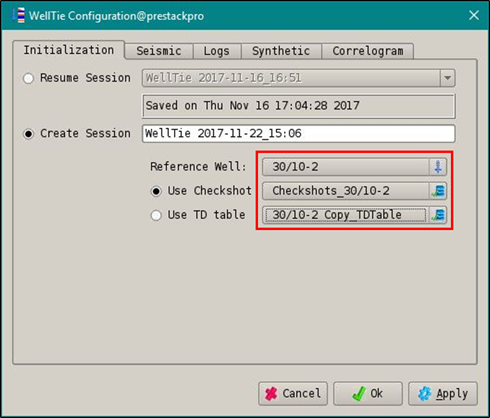
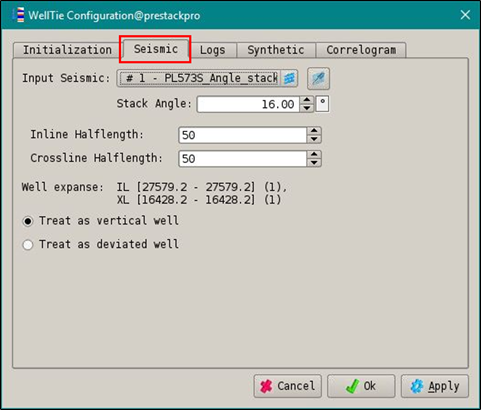
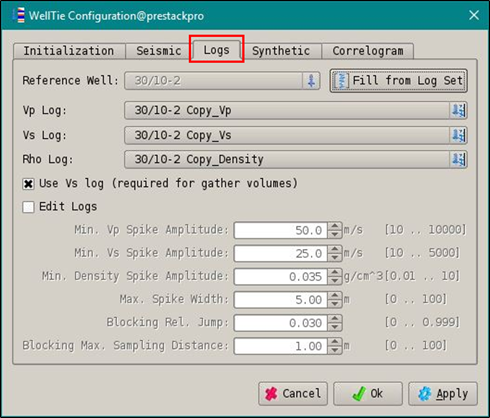
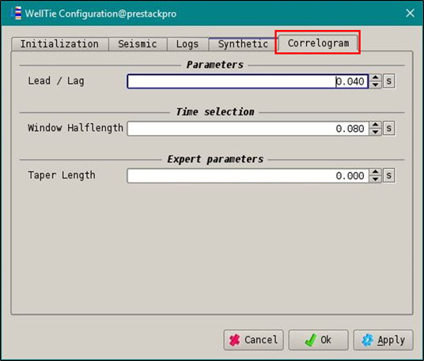

# Launching Well Tie

Launched either from the pulldown menu **Interpretation-Processing &gt; Well Tie**.  
or by clicking on the icon on the left-hand side 

Well Tie starts with the **Configuration** window:

* Select the reference well to tie
* Select a checkshot set or a T/D table or create a new one
* Saved sessions can be resumed

If there is no checkshot or T/D table available, the user can copy one from another well or create a new one by entering a T/D pair. The depth point is in TVDss. Alternatively the pair can be setup from a marker depth and/or a horizon time.

The tabs in the **Configuration** window allow selection of seismic data, logs and an initial wavelet. Once data has been selected, press **OK** to start Well Tie. Data selection can be altered from the main Well Tie window at any time by clicking on the **Configuration** icon.

**Data Selection**  
**Seismic Tab**

* **Input Seismic:** Seismic data loaded into the **Data Pool** is available from the pull-down menu or picked using the dropper icon. Stack or pre-stack seismic can be used.
* **Stack Angle** is the angle used to generate a synthetic for stacked seismic. For pre-stack seismic the angle is used to make a seismic section and can be changed within the Well Tie window.
* **Inline/Crossline half-length** is the extent of the seismic sub-volume loaded into Well Tie. 
* **Deviated wells** can be verticalized. If treated as deviated, seismic data will be extracted along the well path providing the area where the well-path intersects the seismic volume contains more than 6 CDPs.
* **Interpolation method** can be bilinear or using a sinc algorithm. The latter is more precise however takes more time to compute the results.

**Logs Tab**

* Logs can be individually selected or loaded as a group that is saved in a **Log Set**. A Log Set can be created in **Utilities &gt; Manage Log Sets**.
* A $$V_s$$ **log** is required for tying pre-stack seismic. If no $$V_s$$ is present a zero-incidence synthetic gather will be generated for a stacked well tie.
* Toggle on **Edit Logs** to filter the logs if required.

**Synthetic Tab**

* **Initial Wavelet:** Choose a starting wavelet to generate a synthetic. A wavelet saved within the project can be selected or a synthetic Ricker wavelet can be made using by clicking on the **Wavelet** icon. 
* Wavelets can be imported using **Utilities &gt; Well Manager**.

**Correlogram Tab**  

* A sliding cross-correlation window for a single angle plane.

