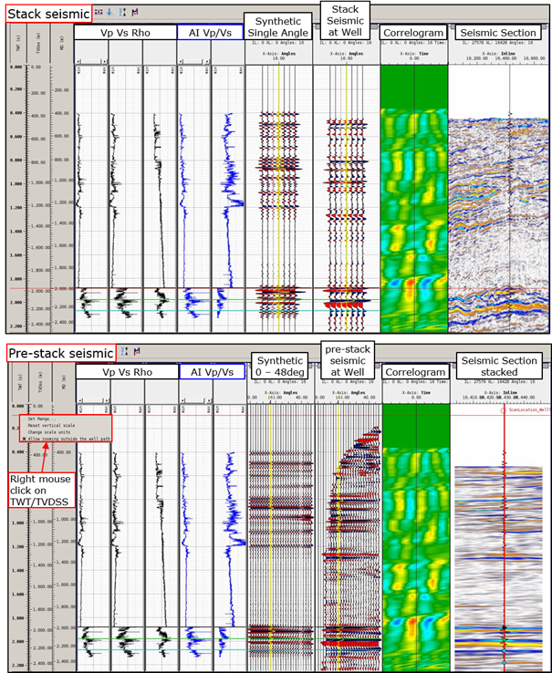
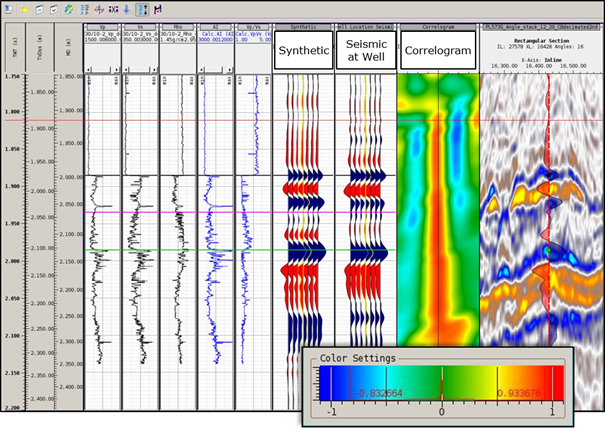
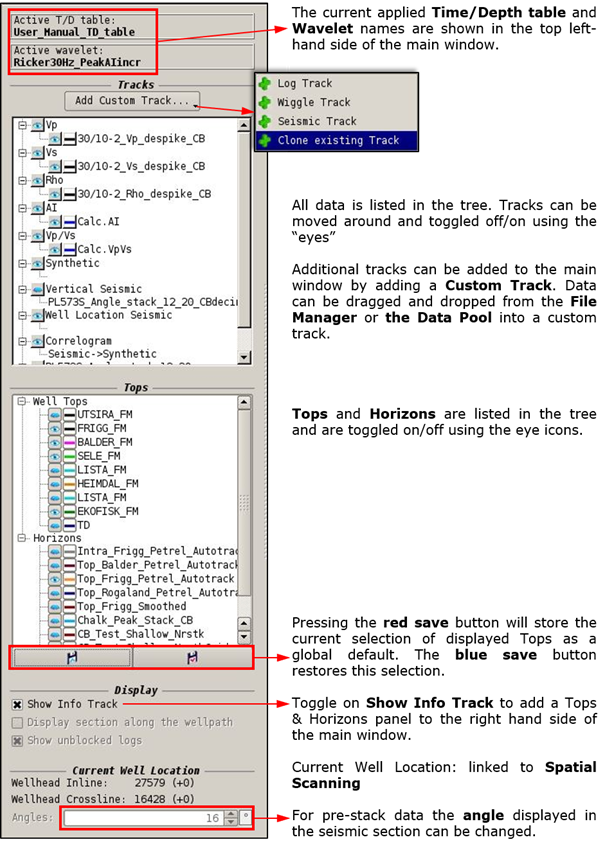
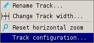
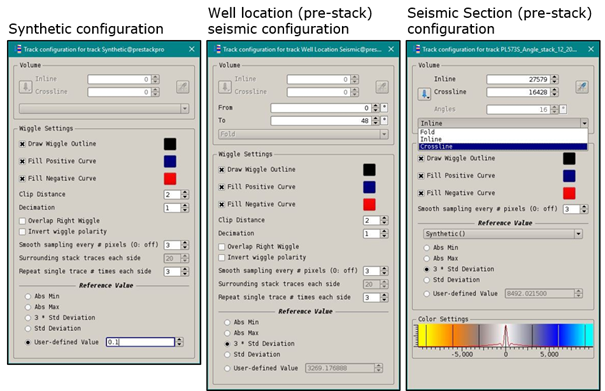
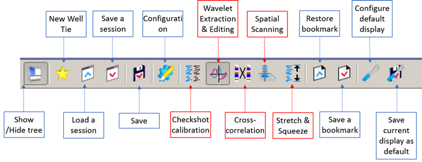
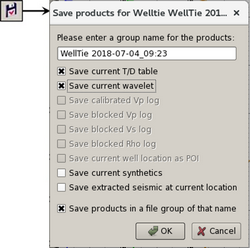
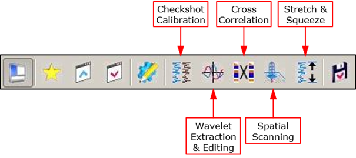

# The Well Tie Window

The main Well Tie window displays:

* The $$V_p V_s Rho$$ logs selected by the user.
* **AI** \(Acoustic Impedance\) and $$V_p/V_s$$ ratio logs. These are calculated by Well Tie.
* An **initial synthetic**, generated using the wavelet selected during initialization. 
* **Seismic at the well location**, for deviated wells this is extracted along the well path for both, stack and pre-stack seismic data.
* **Correlogram**, a sliding window cross-correlation for a single angle plane. For pre-stack seismic this angle is chosen in the bottom left-hand side of the main window. The vertical axis is the centre of the rolling time window, and the horizontal axis is the correlation lag.
* **Seismic section** through the well. If the well is deviated the seismic is extracted along the path of the well. For pre-stack seismic, the gathers are extracted along the deviation survey and stacked on the fly with the angle being controlled at the bottom left-hand side of the main window. The section can be changed, e.g. inline to crossline, by right-mouse clicking on the header and choosing Track Configuration. The gain is controlled via the histogram in **track configuration**.

**Zooming** can be controlled using the mouse wheel on the TWT/TVDSS track – or right-mouse click on the TWT/TVDSS track to manually change the range displayed.

**Correlogram**  
The correlogram is a sliding window cross-correlation for a single angle plane. For pre-stack seismic the angle is defined in the bottom left-hand side of the main window and can be changed by the user.  
The vertical axis is the centre of the rolling time window, and the horizontal axis is the correlation lag.

  
_Main window data tree._

Access the display settings for each track by right-mouse clicking on the track header &gt; **Track configuration:**

**Reference Value** refers to the gain of the synthetic display and can be user defined. The colour scale for the seismic section can be changed by right-mouse clicking on the histogram, colour range is changed by scrolling the mouse wheel on the histogram.

The icons at the top of Well Tie contain the main functionalities for performing a well tie:

**Configuration** enables you to change the data selected \(e.g. choose a different $$V_p$$ log or seismic volume\).  
**Saving a session** will save the current display and the data selection. Multiple sessions may be saved with different names.7  
**Save** gives the user the option to save specific groups of data or individual items \(including T/D tables and wavelets\) into the project. There is an option to set the saved T/D table as active, thus making it the default choice when a T/D is needed by a viewer, a module or an algorithm.

**Bookmark current state** will save the current display and state of all modules and of the main window. By restoring it allows you to get back to a state you were previously happy with. All saved states contain a history. The saved state are deleted when Well Tie is closed. The initial state is saved just after the initialization and can be restored at any time.

**Configure Default display** allows you to set the visibility and width of tracks as default for the user. The current tracks visibility and width can also be set as the user default with the ad hoc icon.

**Well Tie Functions**

**Checkshot Calibration**

The first stage in performing a well tie is to generate a robust time to depth transformation that integrates the checkshot with the well log data.  
The Checkshot Calibration window allows the user to edit the checkshots, calibrate the sonic log, and generate a drift curve. The result is a Time-Depth table that is applied to the synthetic. The goodness-of-fit between the synthetic and the seismic is quantified in Cross-Correlation, where bulk shift changes to the TD table can be made.

**Wavelet Extraction & Editing**

A wavelet is required to generate a synthetic. In a virgin project, with no previously generated wavelet, a Ricker wavelet is created during initialisation of Well Tie. The user then has the option of creating alternative synthetic wavelets, extracting a statistical wavelet from the seismic data or extracting a wavelet using both seismic and well data using the Roy White method. All wavelets can be edited with post processing functions. The synthetic in the main Well Tie window can be updated at any point with a new wavelet; the name of the current wavelet is shown in the top left-hand side of the main window. Again, Cross-Correlation quantifies the well tie, with the option of updating the phase of the current wavelet.

**Cross-Correlation**

How good is your well tie? The user can visually assess the well tie in the main window. However, it is useful to be able to quantify the fit and this is the purpose of the Cross-Correlation window. For stack or pre-stack seismic data the peak of the cross correlation and envelope are displayed in plots. An average bulk time shift is displayed and can be applied to the TD table.  
The average phase rotation required to improve the correlation is also displayed. This phase rotation can then be applied to the current wavelet.

**Spatial Scanning**

In addition to the Cross-Correlation window, Spatial Scanning offers a map view of the quality of the well tie. Horizon based attribute maps are generated by comparing the well synthetic with each trace in a user-defined volume that is windowed around a horizon. The user can select an optimum new well location that offers maximum fit with the well synthetic.

**Stretch & Squeeze**

Not all checkshot sets are of good quality. Old checkshots, or those of dubious provenance, may need considerable editing before a decent well tie can be produced. Therefore, a Stretch & Squeeze function has been included, which provides the user with full control over their checkshots. Bulk shifts can be applied by visually moving the synthetic vs. the seismic, and the T/D table can be stretched and squeezed to force the synthetic to tie the seismic. The user can also use this window to model significant velocity changes without updating the main synthetic and its TD table.  
When certain of the changes made, the user presses Apply to update the main Well Tie synthetic and TD table.

