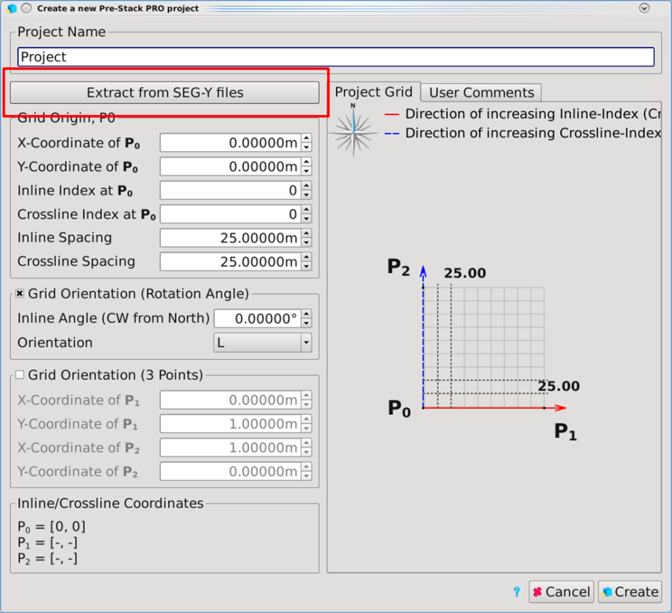
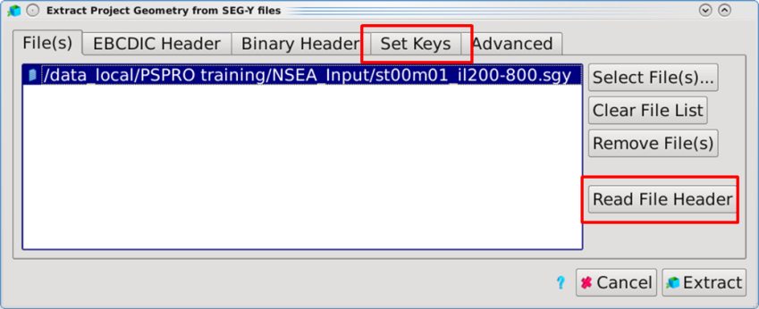
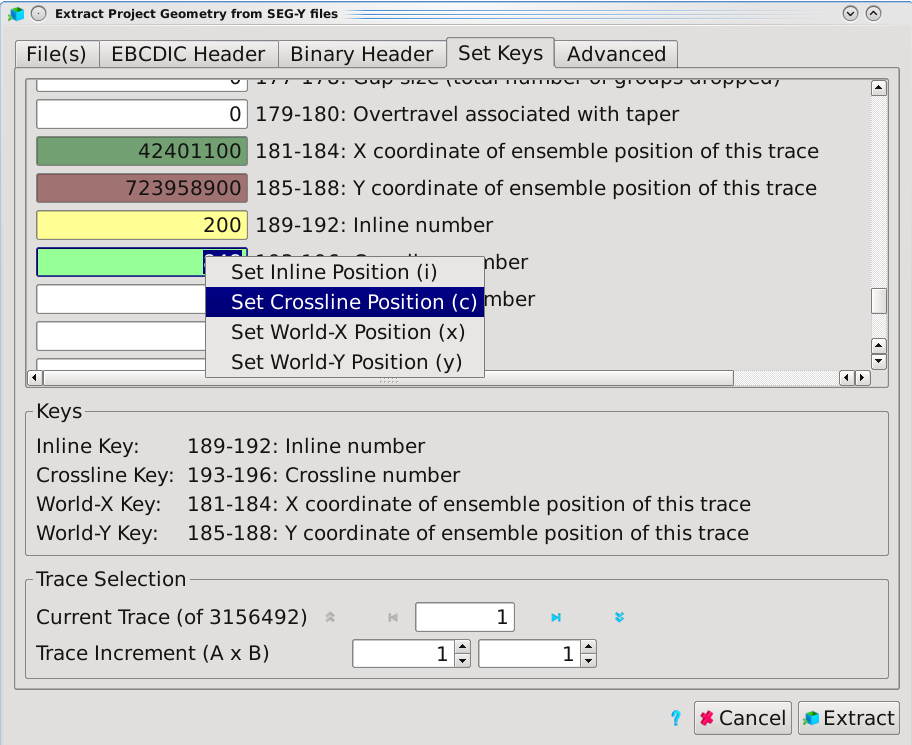
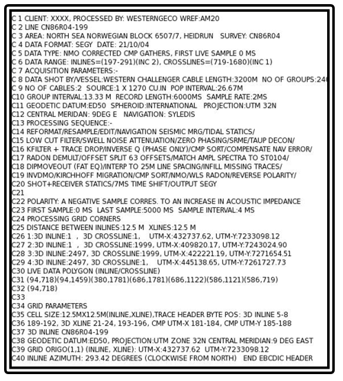
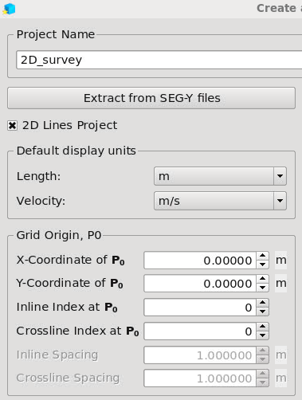
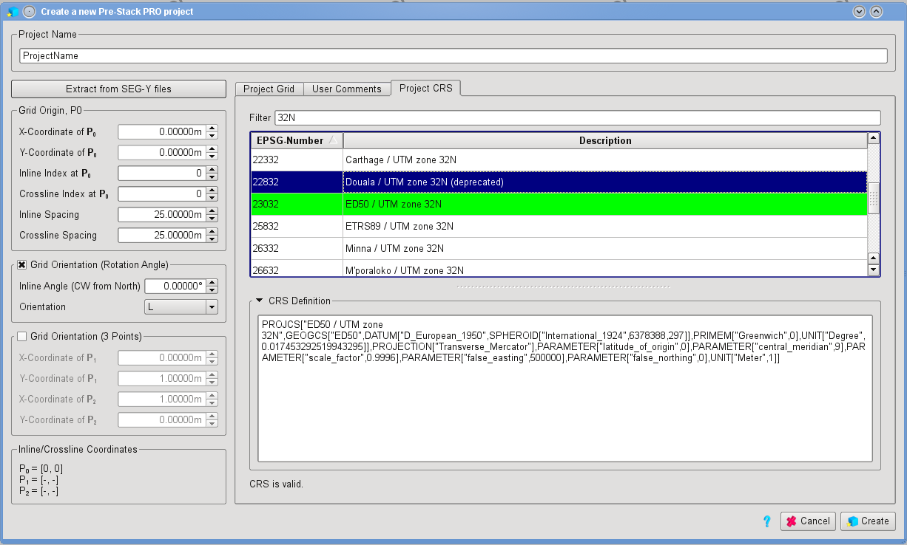

# Create a new Project

The first step towards using Pre-Stack Pro is to create a new project. Go to:

**Project** → **Create Project**, or simply press CTRL + N.

Another option is to use the shortcut option available on the top of the window.

To create a project, the window requires information about the seismic grid geometry. There are two ways to do this. First, this information can be extracted from the SEG-Y file.

Select **Extract from SEG-Y files**, and a SEG-Y scanning window will open. Go to **Select File** and choose the SEG-Y you want to use to define the geometry. You need to click at the **Read File Header** to get the tab selections active in the upper part of the window.

Click on the **Set Keys** tab. In this window you need to locate inline position \(i\), crossline position \(c\), world-x position \(x\) and world-y position \(y\) to the correct byte locations. This is done by right click on the value fields and select from the pop-up menu or by using the short cuts \(in brackets above\). Finally, press **Extract** to create the project geometry settings.

The project geometry parameters are described as:

**PO coordinate:** this UTM-X and UTM-Y coordinate defines the origin of the survey’s grid as displayed on the graphical overview on the right side.

**PO inline/crossline Index**: the index of the origin in Inline and Crossline of PO.

**Distance** corresponds to the distance between each inline and crossline. The grid is adjusted with respect to these values.

**Tips:** If you have only even inlines, for example, the increment would still be the distance between inline 1 and 2, while other software \(e.g.Petrel\) would report it as the distance between inline 2 and 4.

**Define grid orientation via angle:**

This parameter sets the orientation of the survey’s grid by defining the angle of the inline direction \(clockwise from the north\) and the orientation of the grid \(left/right hand side\).

**The second method is to define orientation via corner points**

The parameters set the orientation of the survey’s grid by 2 additional points P1 and P2. Those three coordinates have to form a rectangular coordinate system to be valid.

**P1** is the point of maximum inline index and minimum crossline index.

**P2** is the point of minimum inline index and maximum crossline index.

We recommend using option two \(via corner point\) because the orientation of the coordinate system \(left-handed or right-handed\) is not always stated in the EBCDIC header.

_EBCDIC header_

If your project will contain only 2D lines, tick on the 2D Lines project box.

_2D Lines Project tick box_

Project CRS

A Coordinate Reference System \(CRS\) or Spatial Reference System is necessary to locate geographical entities. It combines a **map projection** and the transform equations between different systems. The map projection defines the transform between the acquisition coordinates \(latitude and longitude measured on a reference ellipsoid or **datum**\) and the project or map coordinates \(World X/ World Y\).

_Project CRS_

Information about the CRS is usually found in the SEGY EBCDIC header. Users can use the\_ filter field to search for specific keywords and narrow down the list of existing CRSs. The current project CRS is displayed in green in the list and can be set by double clicking on the chosen entry. This is then displayed in blue.

* EPSG Number: Geodetic parameter dataset from the European Petroleum Survey Group.
* Description: Official name of the CRS.
* CRS definition: Complete definition of the CRS in Well-Known Text \(WKT\) format. If the desired CRS isn’t present in the list, the user can copy/paste the WKT definition into the field to use a user defined CRS.

The CRS is currently used only when importing cultural data, and will not affect the relative position of any other imported files.

