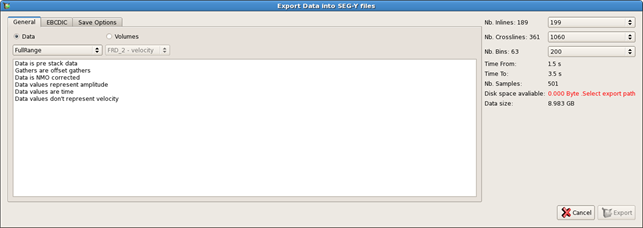
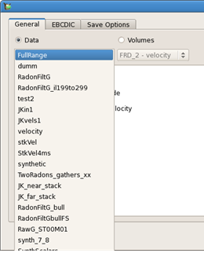
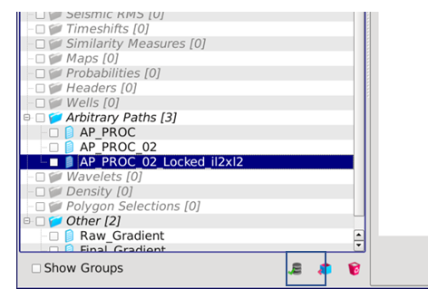
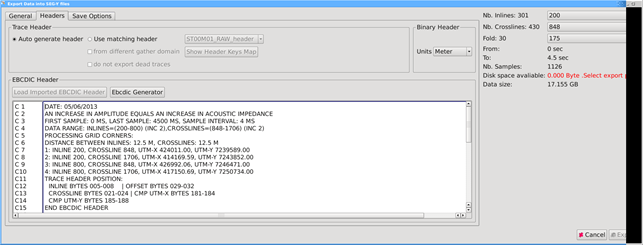
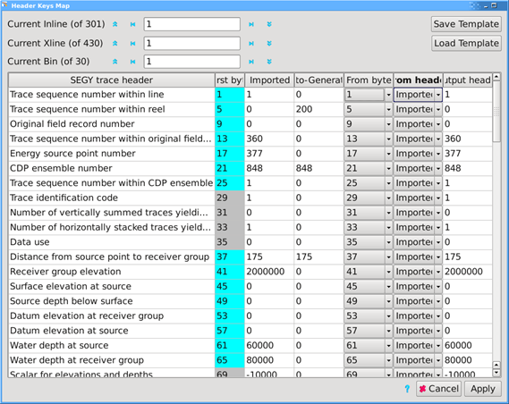
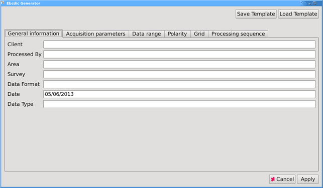
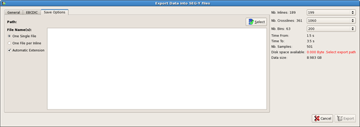
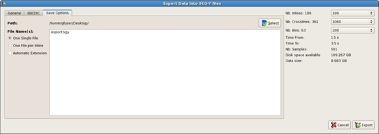
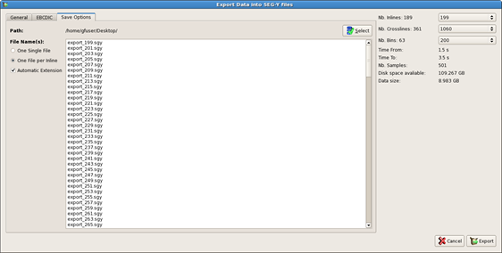

# SEG-Y Export

The data export allows you to export the various data existing in your project as SEGY.

Go to **Project** → **Export Data** → **Export SEGY**

_Export data into SEG-Y file_

In the **General tab**, 2 options are available, Data and volume.

If you select **Data**, all the data stored in the project can be exported. The selection is done by clicking on the drop down arrow.

## Data selection

If you select **Volume**, all the data available in the data pool are available to be exported. This data is not necessarily saved in the project.

Arbitrary Volumes can also be exported as SEG-Y. The trace order is sequential.

It is also possible to select several volumes for batch export of data:

* Selection of one or several volumes in the Data Pool, right click and choose “Export as SEG-Y”.
* Selection of one or several volumes in the File Manager, click on “Export SEG-Y” icon

_“Export SEG-Y” icon in the File Manager_

## **Headers tab:**

_Headers tab_

All headers options are set in this tab. You could choose to have **Auto generate Header** or to **Use matching header**.

**Auto generate Header:** EBCDIC, Binary and Trace headers will be fully generated by Pre-Stack Pro. The EBCDIC header field is a free text field allowing you to type the first 22 lines. Lines 23 to 40 of the header will contain the part auto-generated by the software.

**Use Matching Header:** When importing a dataset from SEG-Y, the headers are saved with the same name as the volume and the suffix “\_header”. Using this option allows the re-use of the original headers when exporting to SEG-Y, if the geometry of the volume is the same or a sub-set of the original volume. If the domain is different \(angle for export while the original imported volume was in offset\), you need to choose **From different gather domain.** The button **Load Imported EBCDIC Header** will load the original EBCDIC header into the dedicated field. The **Show Header Key Map** pops up a GUI for the user to choose between generated or imported for each byte position of the trace header. Also, the user can move trace header bytes from one position to another. Templates can be saved and loaded.

There is a checkbox for you to choose whether you want to have UTM-X/Y written as integer or float.

_Header Key Map GUI_

Whether the user chooses auto-generated or matching header, the **EBCDIC Generator** is a quick way to produce a standardized EBCDIC header by typing text into fixed input data fields. Templates can be saved and loaded. The processing tab of the generator will be automatically filled with the History of the volume to export.

_EBCDIC Generator GUI_

## **Save Options:**

_Save option tab_

The path of the location of the exported file is selected here by clicking on the select button on the top right part.

Once the path is selected, the export information on the right part of the window gets updated with information such as the disk space available and the file\(s\) size.

The data can be exported either in one single file containing all the data or in one file per inline.

_Export as single file \(with and without extension\)_

_One file per inline_

By selecting the **Automatic Extension** option, the file will automatically have the Inline range in the name of the file. This option is a very useful QC tool and is by default active when a file per inline is exported.

