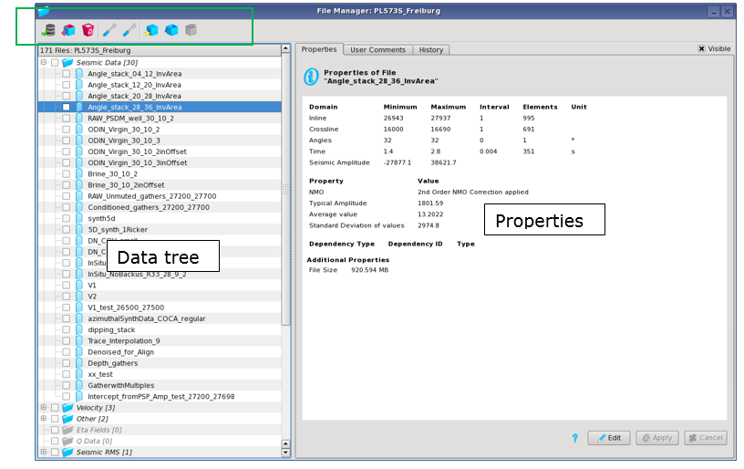

# File Manager

The file Manager allows the deletion and editing of all data stored in the current project. This option can be found in **Project** → **File Manager**

_View manager_

On the left side of the Manager, all existing files are displayed in a tree view according to their content.

The right hand side of the window shows the properties, user comments and the history of the data selected. The properties tab provides a quick overview over the current file’s properties, domains and units. If needed these properties can be edited using a simple, easy to use GUI.

For horizons, the color of the horizon when overlayed on seismic data in any 2D side viewer can be changed when the horizon is selected.

