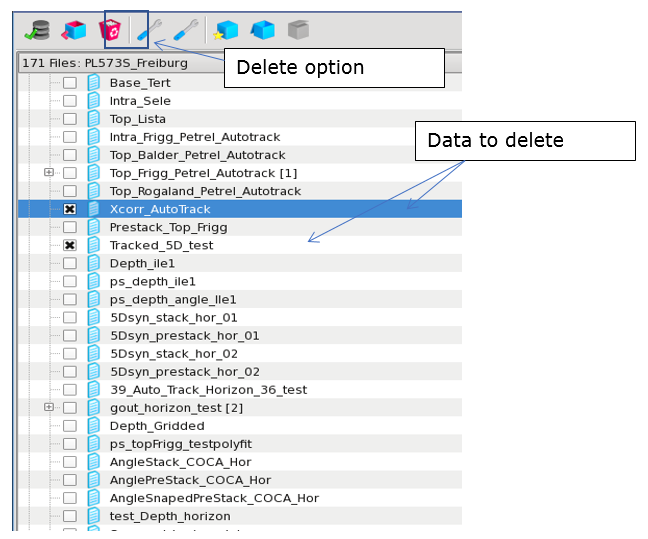
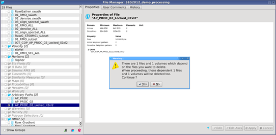

# Delete data

To delete a volume from the project, go to the file manager. On the data tree, toggle on the data to delete. Then click on the delete button  at the top of this window. Multiple datasets can also be selected for deletion.

_Delete data_

If the data you want to delete has been imported from SEG-Y and the Headers associated with it are stored, the File Manager will warn you that those Headers will be deleted together with the seismic data.

Deleting Arbitrary Paths: If you choose to delete a locked Arbitrary Path, the File Manager will also propose to delete any existing children.

_Message proposing deletion of volumes associated with a locked Arbitrary Path_

