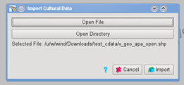
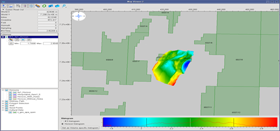

# Import Cultural Data

To import cultural data go to:

**Project** → **Import Data** → **Import Cultural Data**

_Import Cultural Data_

Cultural data should be imported as **shapefiles**. This database format will contain information about the map projection of the data and Pre-Stack Pro will do the conversion between the data’s CRS and the [project's CRS](../../create_a_new_project.md) to make sure that objects are displayed at their correct inline/crossline positions.

_Cultural Data in the Map Viewer_

Once imported, cultural data can be displayed in the viewers by toggling-on the corresponding eye icon in the bottom left corner. They can also be accessed from the File Manager.

