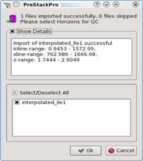

# Import Horizon

Seismic horizon can be imported into Pre-Stack Pro via ASCII format. To import a horizon:

**Project** → **Import** **Data** → **Import** **Horizon** → **Select File\(s\)**

For Horizons, the minimum information required is the following:

* Inline/Crossline or World-X/World-Y coordinates
* Time or depth.

**Tips:** Some of the common interpretation/modelling software use negative values for depth \(negative Z\). Pre-Stack Pro uses positive Z values. Therefore, it is often necessary to use the **Remove Character** option to exclude the negative sign.

**Additional parameters tab:**

The additional parameter tab allows the user to define the Null value as well as the color of the horizon, as viewed in any 2D viewer. The color can also be updated in the viewers themselves.

**Horizon Import QC:**

Once the horizons have been loaded into Pre-Stack Pro, a box will appear to QC the import. This will state the number of files successfully imported. It will specific the inline, crossline and z range for those read in.

_QC of imported horizons_

Click **Ok**, and the new horizons will appear in a **map viewer**. The **horizon tools** dialog will also open up. This will allow the user to manipulate the imported horizons. See the section about the [Horizon Toolkit](../../algorithm_documentation/readme.4/readme.16/).

