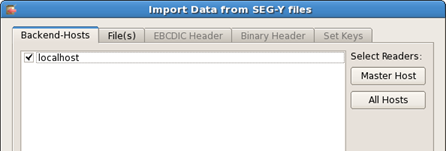
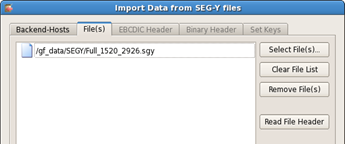
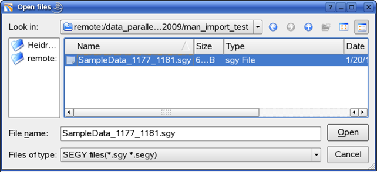
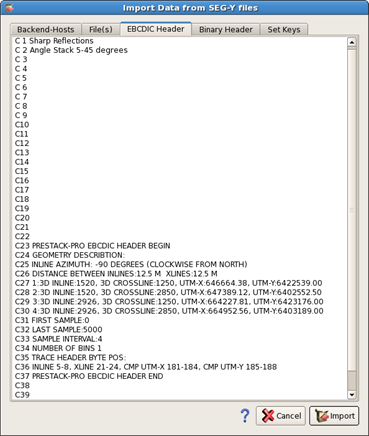
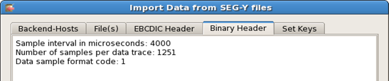
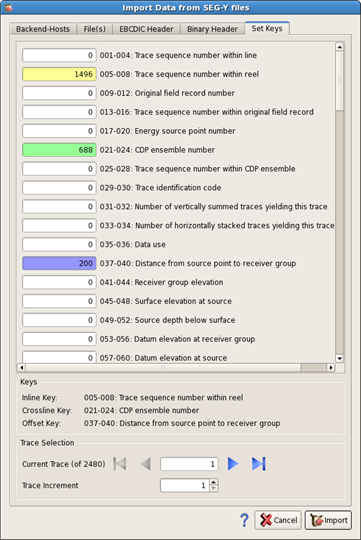
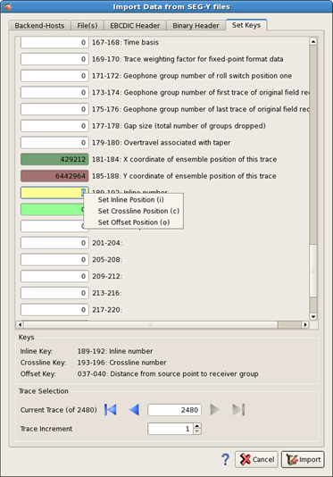
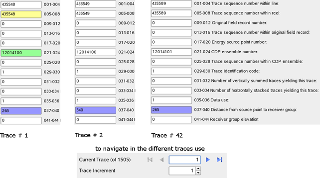

# Import SEG-Y

Pre-Stack Pro works on regular grids, it will load and display SEGY file\(s\) that have a rectangular or cuboid shape, with a constant number of inlines, crosslines and offset distances.

Seismic amplitudes, Velocities, Q data, Eta fields, SRMS data can be loaded using the following procedure:

Select **Project** → **Import Data** → **Import SEGY** from the main menu bar.

The **Import Data from SEGY files** dialog opens.

## **Backend Host:**

The first tab is the **Backend Hosts**.

_Import SEG-Y dialog_

In this tab, you can find a list of the hosts that are running the Pre-Stack Pro backend application and are potential file reader. By activating the checkbox next to the host’s name, you select it to read files.

If the SEGY files are on a **local file system**, only the backend host can see the file and therefore be the reader. In most of the cases, the **master Host** is the one that can see the files.

If the files are on a **parallel file system**, we recommend using all the backend hosts for reading at maximum speed. By clicking the **“Use all Hosts”** button, you select all nodes to be reader.

## **File\(s\):**

The second tab is the **file\(s\)** tab.

_File\(s\) tab_

In this tab, the import selection can be done for the current project. You can

* select more files by clicking the “select file\(s\)” button
* remove one or more files by clicking the “remove file\(s\)” button
* clear the whole list by clicking the “clear list” button.

When selecting the select file option, the open file window pops up.

_Data import_

Selected files appear in the **file\(s\)** dialog window.

Press the **Read File Header** button and the grayed out three tabs \(EBCDIC header, Binary header, Set Keys\) become active.

These tabs contain header information from the first file in the selection list.

## **EBCDIC Header:**

A SEGY formatted file usually consists of four parts, the Extended Binary Coded Decimals Interchange Code \(EBCDIC\) header, the Binary header, the trace headers and the trace data.

All three headers are saved in the project during Import. Those headers can be used and copied to a matching dataset during SEG-Y export \(see [ SEG-Y Export](../../data_export/seg-y_export/)\).

The **EBCDIC Header** tab contains information which may be provided by the creator of the SEGY datafile. It is commonly used to store general information about the origin, coordinates, already applied filters, number of inlines and crosslines in the datafile. For more information about the EBCDIC Header please refer to the documentation of the SEG-Y format at the SEG homepage [www.seg.org](http://www.seg.org) .

_EBCDIC tab_

The next tab, **Binary Header**, displays the information stored in the binary header; it contains information about sample interval, number of traces, number of samples per trace, data format and measure units.

Additional parameters are also provided in the trace header of every trace in the last part of the SEGY file.

_Binary Header tab_

Pre-Stack Pro assumes that all information respect the conventions adopted as SEGY Revision 1 standard. For detailed information on this standard see:

[http://www.seg.org/resources/publications/misc/technical-standards](http://www.seg.org/resources/publications/misc/technical-standards)

If your data does not conform to the standard you must modify header key locations prior to loading. See following section for further information on this procedure.

## **Set Key:**

The **Set Keys** tab contains the information about the data, their position in the trace header and a short description for the corresponding fields as recommended by the SEG.

_Set key window_

You can scan through the trace headers by using the step buttons \(blue triangles\) on the lower end of the window.

The following parameters are required in Pre-Stack Pro:

| Parameter | Default byte location |
| :--- | :--- |
| inline number of current trace | 189 – 192 |
| crossline number of current trace | 193 - 196 |
| offset distance of current trace | 037 - 040 |
| Time lag of current trace | 109 - 110 |

This information is often stored in a different byte location. The header position for the Inlines \(i\), Crosslines \(c\) and Offset\(o\) can be selected by clicking on the field and selecting the specific key \(I, c, or o\) for the information

* activate field and press “i” for the inline number, the field will then be highlighted in yellow
* activate field and press “c” for the crossline number, the field will then be highlighted in lightgreen
* activate field and press “o” for the offset/angle, the field will then be highlighted in blue

_Assignment of inline crossline_

Coordinate fields are also highlighted in dark green and brown. The trace lag is highlighted in grey.

As Pre-Stack Pro is working with pre-stack data, it expects a finite number of offsets \(bins\) to be present in your dataset.

If you do not know the header location for your SEGY file, you can scan the traces using the **play forward, play backward** and the **trace increment** buttons on the lower end of this window.

_Data inspection by scanning through trace headers. Use of the play forward, play backward and the Trace Increment field._

_On this example, Trace 1 contains data with a 265m source receiver distance. Offset increases progressively for each step until trace 42, where data from the next gather CDP 12014101 begins \(again with 265m source-offset distance\)._

Once the three byte locations of the parameters are correctly set press **Import button** to start the process of importing your data.

Pre-Stack Pro will check for **regularity**. Seismic data is often sampled on irregular grids and will attempt to regularize the data so it can be stored in an efficient way and data access time will be minimized.

