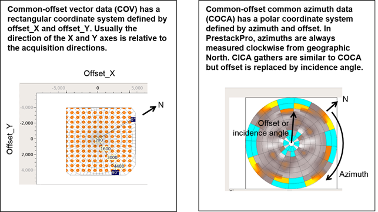
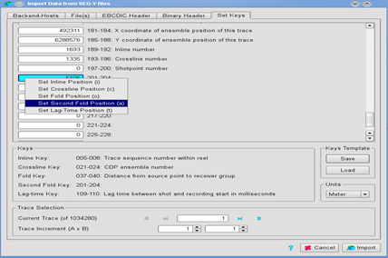
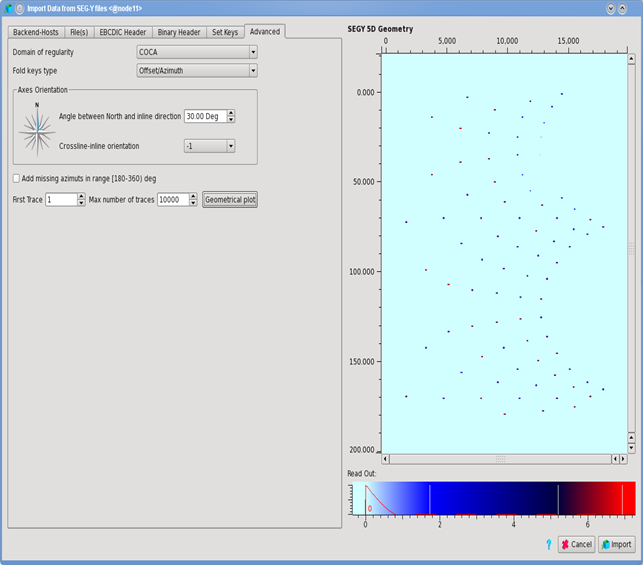
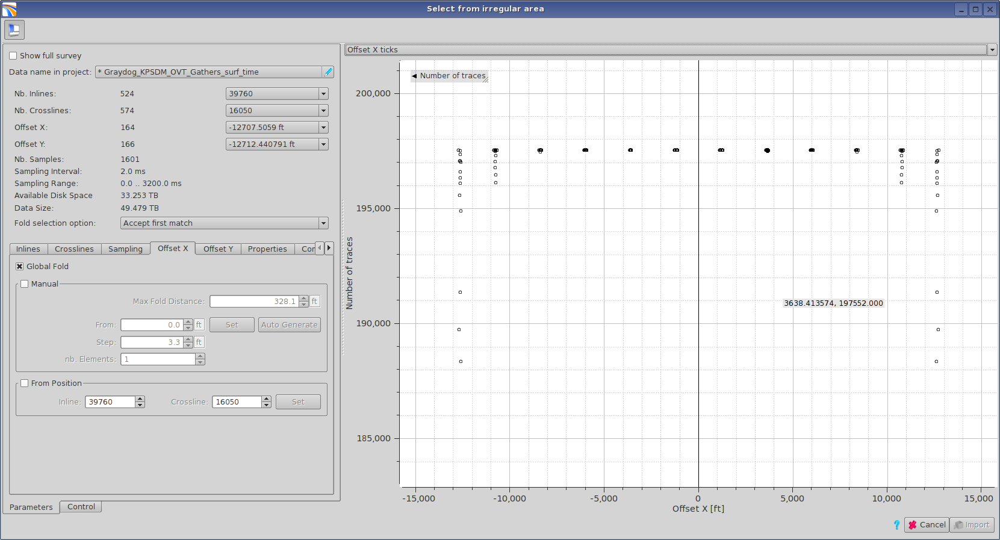
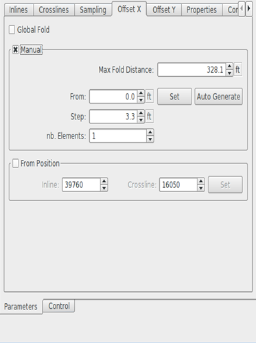

# Import of multi-azimuth SEG-Y

The software supports the import of multi-azimuth data.

It is possible to import three types of wide azimuth gathers into Pre-Stack Pro.

* **COV** = Common Offset Vectors: traces in the multi-dimensional gathers are sorted on a Cartesian grid with the fold dimensions being _offset X_ and _offset Y_.
* **COCA** = Common Offset Common Azimuth: traces in the gather are sorted on a polar grid. Folds dimensions are _offsets_ and _azimuths_.
* **CICA** = Common incidence Angle Common Azimuth: traces are also sorted on a polar grid with fold dimensions being _angles of incidence_ and _azimuths_.

Import is identical to other files with the exception that a **second fold position** has to be specified. This second fold \(either azimuth or offset Y\) can be selected by right clicking on the corresponding byte location and selecting “Set second Fold Position \(a\)” or alternatively by left click on the field and using the keyboard shortcut “a”. A lightblue color will then highlight the corresponding key.

_Set the second fold position for 5D SEG-Ys_

In the next tab you must set the corresponding domain of regularity as well as details about the geometry of the file.

**Domain of regularity:** grid system for the data: COCA \(valid for both angles and offset data\) or COV.

**Fold Keys type:** type of the values defining the fold: Offset-X/Y or Offset\(Angle\)/Azimuth.

The group Axes orientation is prefilled with values taken from the project geometry. It defined the orientation of the inline and crossline compared to North. The crossline-inline orientation is L or R, as defined by the right-hand rule.

There is an option to mirror existing azimuth if necessary.

The **Geometrical plot** button will update the preview displaying Offset X/Y based on the parameters entered, thus controlling their validity.

  
_Advanced parameters for wide azimuth data SEG-Y import_

The regularization process will follow if necessary. The main difference with narrow azimuth SEG-Y is that in the case of COV, a manual definition of the offsets is more probable.

The [regularization window](loading_irregular_data/) will have two extra statistics: Offset X and Offset Y ticks. Those are graph showing the number of occurrences on the Y-axis versus the offset value on the X-axis.  
  
_Offset X ticks graph_

If the offset values do not describe a regular increment, then they need to be defined manually.

The parameters are classic:

**From** defines the center value of the first offset class.

**Step** is the increment value between classes and **nb. Elements** is the number of offset classes.

_User Interface to manually define offset classes_

**Max Fold Distance** is the most important parameter as it defines the search radius. It should be set roughly to half the size of the expected offset class. Once this has been setup the **Auto Generate** button will scan the data and propose a definition. The graph will be updated with a graphical feedback of the classes definition: blue line defining the center of each offset class and red lines defining their boundaries.

