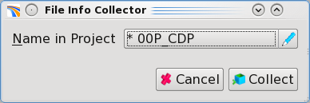
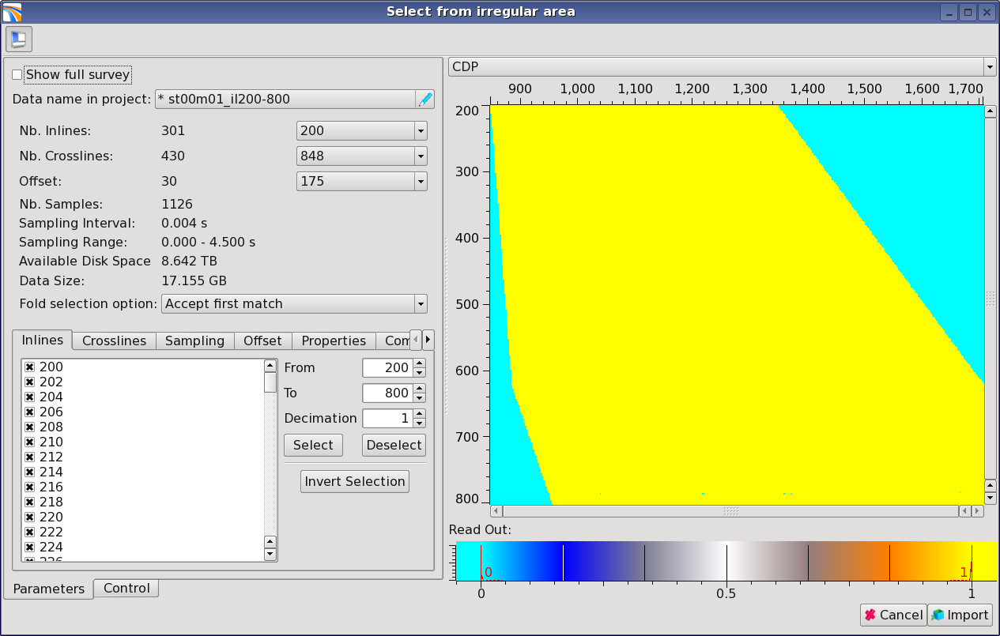

# Import 'irregular' data

Pre-Stack Pro stores seismic data in regular grids, with a fixed file size dimension in the inline, crossline, time, and offset direction.

To avoid the need to scan the trace headers every time these SEGY file\(s\) are read, the program will store information about data consistence and regularization in a lookup table.

Enter a name for this lookup table. This will be stored into the project. For large files, scanning can take several hours. A scan-time estimate is provided in a log window.

_Dialog used to name the lookup table for the automatic regularization_

Once scanning is complete a window opens that contains information about the content of the data file\(s\)

_Regularization dialog: map of the data and options to choose for the regularization process_

**For large files** enlarge this window to increase the level of details displayed. This window contains a map of all inline and crossline traces within data file\(s\). By default, live traces are shown in yellow and missing traces are in blue. The color is based on a color palette, visible from the **Histogram** on the lower right side of the window, and the chosen sorting parameter \(**CDP** by default\). The current sorting parameter is displayed in the **Statistic** drop-down menu on the upper right corner of the window.

It is reasonable to scan the dataset in a particular sequence. One should start with the inlines. To zoom into the map use the mouse wheel.

By default the program assumes that data for every inline and crossline exist as well as the full range of offsets \(bins\). Therefore, the user will have to adjust some settings depending on the input data.

A striped pattern of alternating blue and yellow lines indicates that only every nth inline is present.

