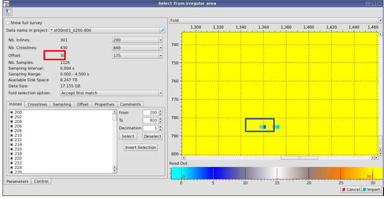
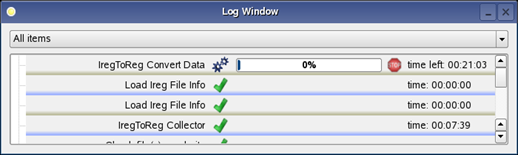

# Set regularization parameters

To set regularization parameters:

* Provide a name for the dataset
* Set the regularization routine \(for example\) to only every second live inline:

Press **Deselect** → **Step** = 2

Press **Select**. As the result only every second live inline will be checked on. Set the **Step** factor according to your data to avoid loading of traces that do not exist.

* Next change the crossline selection to a setting matching the input data. This is done in the same way as the inline setting.
* an adjustment to the input data can be made in the **Time/Depth** tab.
* Many pre-stack datasets have a variable number of **offsets/angles** at different inline/crossline locations.

To see a **fold map** change the Statistics parameter from **CDP** to **Fold** in the **Statistic** drop-down menu.

_Fold map_

In most cases, you will regularize the offset equal to the max value \(in this case 30 highlighted in red\). There are three ways of setting the number of offsets:

1. **Global Bins** – maximum offset is set to the largest offset/angle found within the SEGY file
2. **Manual** – user defined geometry
3. **From Position** – offset geometry is determined from a single user-specified inline/crossline location

Note that traces with fewer offsets will be regularized by the algorithm; it will fill these offsets with zeros. This occurs by default if you select the **Global Bins** setting.

**Fold** for any inline/crossline location can be checked using the pull-down menus in the lower right corner of this window. In addition, the number of samples and a size estimate of the import data file size are given.

The current settings made by the user are displayed in the upper left corner of the **Select from irregular area** window.

Press **Import** and the regularization routine will begin. The current window will close and the **Log Window** will appear, displaying the progress and the estimated time left to fully import the data.

_The Log Window shows progress of SEGY data import._

