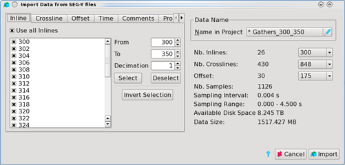
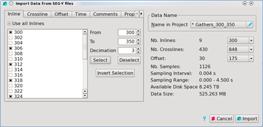
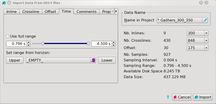
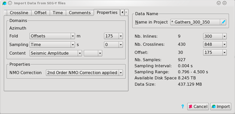
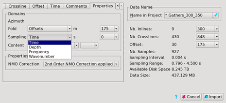
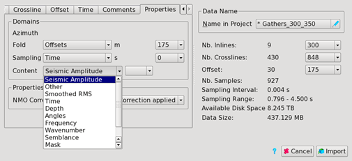

# Loading regular data

Once file scanning is complete, the **Import Data from SEGY files** dialog shows the content of your regular \(constant number of inlines, crosslines, bins and time range - “cuboid” shape\) SEGY file\(s\) and you must select the desired area out of the whole dataset.

_Import data from SEGY file_

On the right part of the window, **name the data** as wanted in the project. Please keep in mind the name should not contain any whitespace character.

The **file information** provides you with a short feedback and overview over the dimensions, sampling and size of the imported file.

On the left side, you can select which **data range to import**. This selection is done in the Inlines, Crosslines, Sampling, and Fold tab.

There are several ways of doing it:

* Manually mark/unmark the desired selection of data from the list
* Use of the Use all Inlines/Crosslines tick box
* A more convenient way to specify a range is using the From and To selection. The Step allows you not only to define a range but also an increment within the range. You will need to click on Select after filling the field From, To and Steps.

_Step selection on inlines_

The file information will be updated based on the data selected.

The procedure to select crosslines is the same as that for inlines.

In the **time tab**, you can cut the imported files in time or depth \(depending on the importing properties\). Just select the range of data you want to have imported.

_Time tab_

Similarly, to the time & depth cut, you can also decide which angle/offset to import. This selection is done on the **Fold tab**.

## The properties tab:

This tab allows to set the properties of their imported volume correctly. Please keep in mind that there is no automatic property extraction from the Imported SEGY file. Therefore, it is vital to make sure these properties are set correctly before proceeding, especially the type of SEGY data in the content property.

_Properties tab_

In the Domains part, the sampling domain, the fold and the content must be specified.

The sampling can be tagged as time, depth or frequency.

_Sampling domain_

Pre-Stack Pro has the possibility to import data in offset or angle. The type of fold is defined in the fold option

A SEGY file is a generic format which can be used for different type of data.

In the Content part you can specify which type of data you are importing as SEGY: Seismic Amplitudes, Velocities, Q data, Eta Fields…

_Content property_

Based on the content selected, additional information is needed in the properties part of the tab.

As an example, when Seismic amplitude is selected as content, the NMO Correction applied to the data is required.

When selections are complete, press **Import.** Pre-Stack Pro will begin importing immediately. A time estimate for the importing process is given in the **Log Window**

