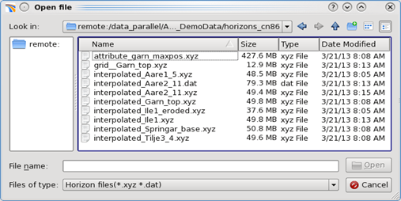

# File Selection

Select the folder and file with the data. A default extension will be pre-selected, which is dependent on the data type. For example, dks \(DISKOS format\) is shown for velocities. You can press the **All files \(\*\)** option to view all file formats.

_Select ASCII file_

Several objects can be imported at the same time if the file format is the same. Just use the Shift or Control button on the keyboard to mark several files.

Then press **Open.** This will open the Pre-Stack Pro ASCII-Importer.

