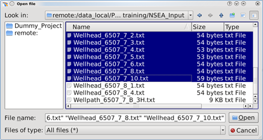
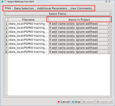
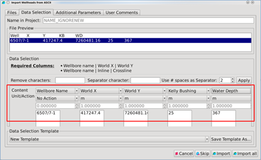

# Import Well Heads

**Go to Project** → **Import Wells** → **Import Well Heads**

_Select files for well head import_

_Choice of well to assign the head to_

Under the **Files** tab you can view the file name and choose whether the well heads should have a new name inside the project or not. This is done by clicking on the small pull-down arrow to the left of the filename\(s\).

_Defining the columns_

**Picking the live data:**

Go to the **Data Selection** tab and the live data in the file will appear in the ‘File Preview’ area. Choose the first line with data by clicking with the right mouse-button. A context menu opens that allows you to **Start data import from here.** See the section about [picking live data](../readme.2/picking_the_live_data.md) for the details.

**Separating the columns:**

For Well heads, the information required is the following:

* World-X/World-Y coordinates
* Wellbore name

Optional, but important information are

* Kelly Bushing
* Water Depth

