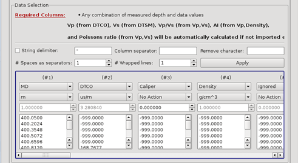

# Import Well logs from LAS files

Logs can be imported using **Project** → **Import Data** → **Import Well logs** from ASCII \( .las \) files; with a user definable number of wrapped lines between 1 and 50. Any combination of MD and log data values are allowed.

_Example of a .las file import with no wrapped lines. \( \# =1 \)MD, P sonic, Caliper and Density logs defined in the first 4 columnsCaliper log type coming from extra user definitions in the template_

However, this version of the Pre-Stack Pro ASCII import application only allows **1 log of each type / importing run**. \( eg: a set of brine Vp, Vs, rho logs can be loaded in 1 run but 3 Vp logs, brine, oil & gas will need 3 runs \).

Templates can be used to automate log range, units and colour allocation, on import, for default and user custom log types.

Templates can be saved, either from the ASCII importer or from the Well Log Viewer itself - in $HOME/.PreStackPro/ASCIITemplates, as \*.WellLogs files.

If just a P wave sonic and a density curve are imported; Pre-Stack Pro will calculate a **Vp** and an **AI** log as well.

If just P & S wave sonics and a density curve are imported; Pre-Stack Pro will calculate a **Vp, Vs, AI, Vp/Vs ratio** and a **poissons ratio** log for the user.

If all these curves are in the ASCII \( .las \) file, they can be allocated a type and imported directly instead.

_Defining default and user log types – ASCII well log importerLog type, range, units and colour can be set and saved as a template_

