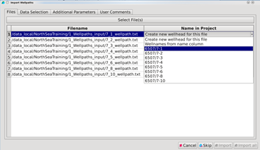
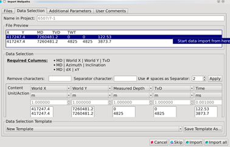
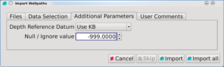
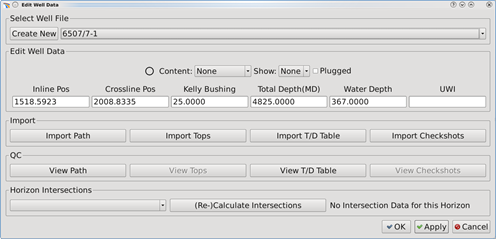
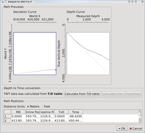

# Import Well Path

**Go to Project** → **Import Wells** → **Import Well Paths**

To start importing, select file\(s\) as for well heads \(previous section\). In this step it is important that you assign the wellpath to the corresponding well head name in the project \(You defined that in the previous section\). Under the **Files** tab, click on the small pull-down arrow to the right of the file name\(s\) and select the correct name.

Pick the live data and separate the columns as for the well heads. For well paths, the information required is one of the following combinations:

* World-X/World-Y coordinates, Measured Depth \(MD\), True Vertical Depth \(TVD\)
* MD, Azimuth, Inclination
* MD, dX, dY

If you have time data in the same file, it is also recommended to select ‘Time’ as one of the columns. Then you do not need to import that separately later on.

**Additional Parameters tab:**

This tab allows you to set the depth reference datum and set null values to be ignored. This means that each column entry equal to this value will be ignored when importing the file.

**QC well path**

To QC your Well data, open **Utilities** → **Edit Well Data.** In this dialogue, you can create new well names, import well data, edit the well data and do QC.

For each well it is important the check that the well head data are correct, and use the **View Path** diagrams and tables to check that all data are imported correctly. Horizontal deviation curve and depth curve can be viewed from diagrams. Paths positions of Measured Depth can also be read out from the table below with its corresponding Inline/Crossline numbers, TvD and Time numbers \(if T/D table/Checkshots are available\).

