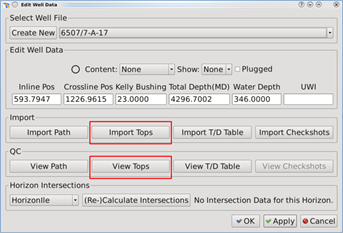
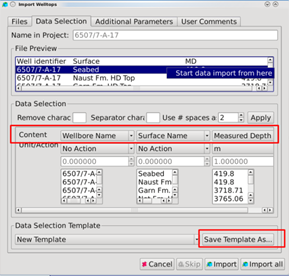

# Import Well Tops

Go to **Project** → **Import Wells** → **Import Well Tops,** or more simple, from **Utilities** → **Edit Well Data**

To import well tops select **Import Tops**. The process of picking live data is equal as for importing well path. Only columns with Wellbore Name, Surface Name and Measured Depth are required.

**View Tops:**

The imported Well Tops can be viewed for QC by clicking **View Tops**. See [Manage Tops](../../../utilities_and_setting/manage-tops.md) for mode details.

