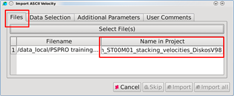

# 3D ASCII

To import ASCII data:

Go to **Project** → **Import Data** → **Import Velocity**

Select a velocity file and click **Open** to display the ‘Import ASCII Velocity’dialog. Click on **Select File.** This will open the Pre-Stack Pro ASCII-Importer.

_Velocity data file selection_

Under the **Files** tab, the selected file can be assigned to a project name

_Import velocity from ASCII files_

**Separating the columns:**

For velocities the minimum information required is the following:

* Inline/Crossline or World-X/World-Y coordinates,
* Time or Depth
* Velocity

**Remove Characters from Data:**

A typical case for this is the Esso v2 velocity format. Some dialects of the standard contain the characters V2 directly attached to the inline information \(e.g. V21099 is the text for inline 1099\) and these characters have to be removed to be able to import this file. To achieve this, the user has to type in the characters to be removed \(V2 in this case\) and click the Apply-Button.

**Target sampling Distance:**

Go to the **Additional Parameters** tab. The target sampling that is provided here will be used for importing the selected column based ASCII file into Pre-Stack Pro. Every existing trace will be resampled using the given sampling interval.

If the file is not sampled regularly, using the default value is a good start. Another option would be to use the same sampling interval as the seismic data.

If the actual sampling interval is constant and known, this can be used too. Should a bigger interval than the one of the ASCII file be used, information is going to be lost!!

**Velocity:**

Each velocity in Pre-Stack Pro has 2 properties. The first property is the vertical axis \(time or depth\) and is set on the previous tab.

The other property defines if the velocity is an RMS or an interval velocity. This is set simply by toggling the type of velocity in this window.

Please keep in mind that the combination of **RMS and depth is invalid.**

**Output raw data as velocity function:**

This will create an additional object: Velocity Functions. The original picks will be read from the ASCII and converted into a set of functions to be used with the Manual Velocity Editor. No interpolation is done, the original position in space and time will be preserved.

