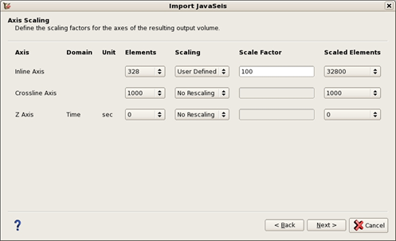

# Axes scaling

In the axis scaling window the user can define the scaling factors for the axes of the resulting volume.

_Scaling window_

The scaling methods available are:

* No scaling
* User defined: which requires the user to set a scale factor manually
* Auto Conversion: this option is detected automatically if a predefined scaling factor is specified or needed \(e.g. from feet to meter\)

