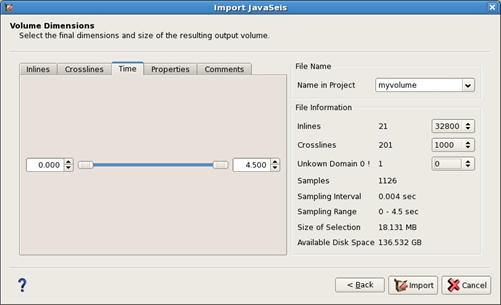

# Volume dimensions

_Volume dimension tab_

This tab allows the user to select the dimensions and size of the volume to import in Pre-Stack Pro. On the different tabs, \(inline, crossline, time\) select the range and steps of data to import. An overview of the file spec is available on the right part of this tab \(size, number of lines, time range…\) Press apply and the data is now available and can be selected.

