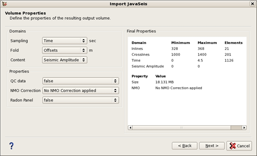

# Volume properties tab

_Volume properties tab_

In the volume properties tab the user can define the properties of the resulting output volume

**Domains:**

In this tab it is possible to set the domain of all axes other than Inline and Crossline.

This tab is particularly useful when the properties need modification after import.

**Properties:**

This tab is similar to the properties tab in the [SEGY import user interface](../import_seg-y/).

