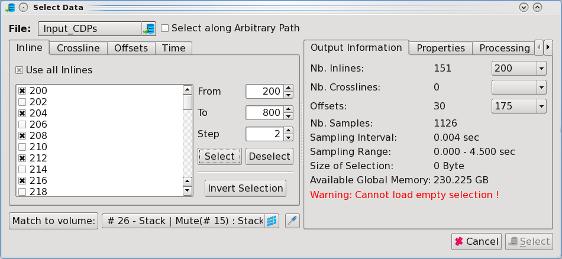
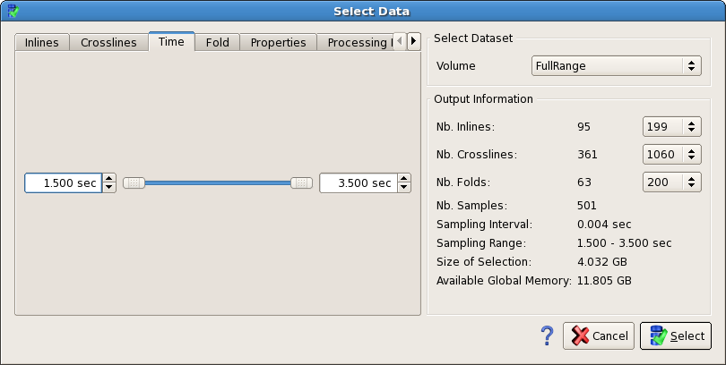
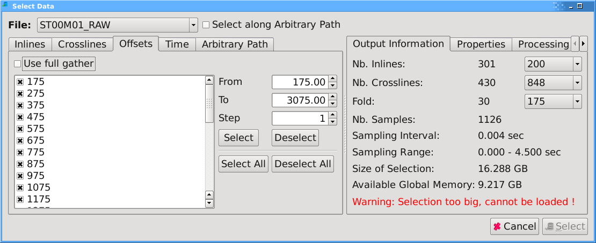
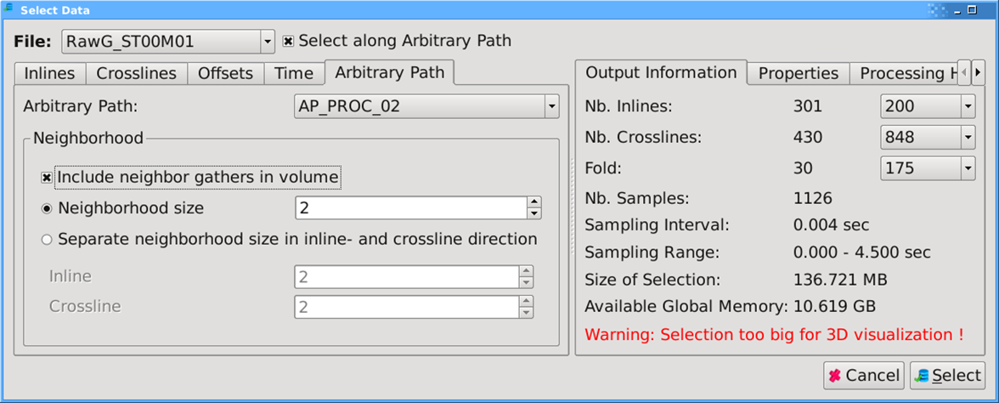
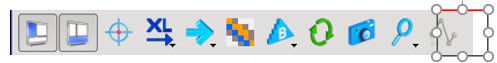
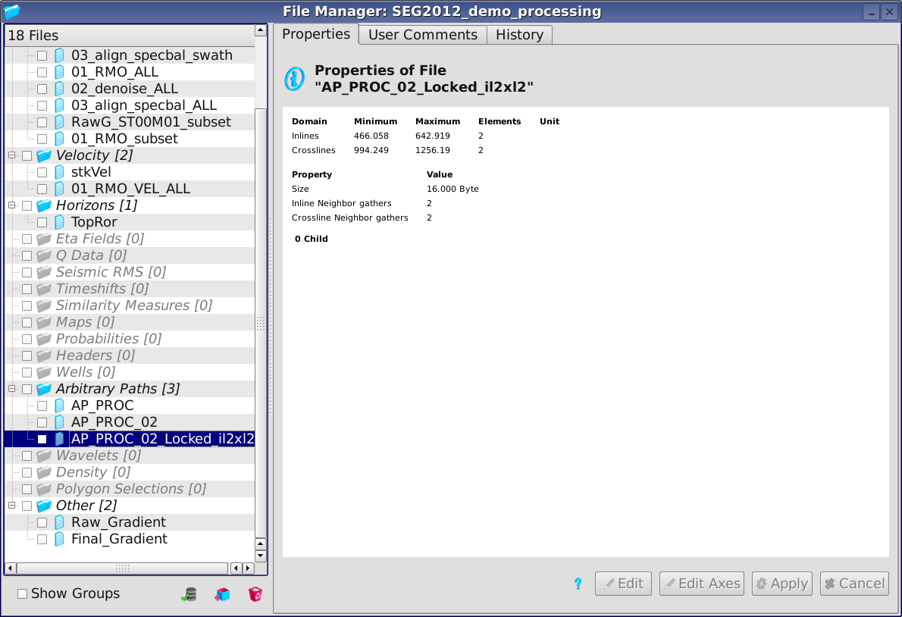
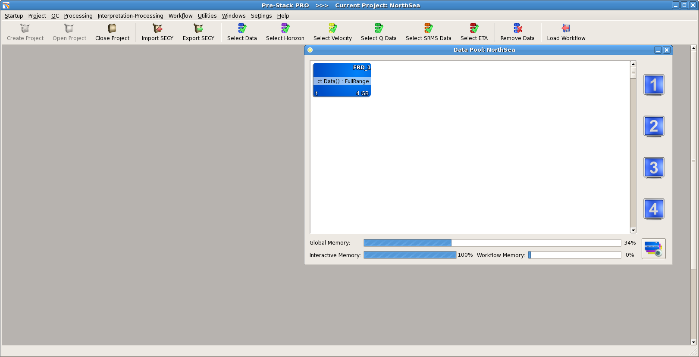
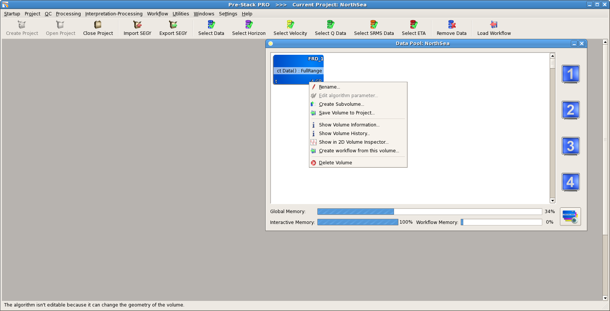

# Interactive data selection

When 'data' is mentioned in the following it refers to seismic data.

To specify an area of interest from the entire imported seismic dataset:

Go to **Project** → **Select Data** → **Select Data**.

_Select data_

In the opening window you can:

* Filter your dataset by a selection of inline, crossline numbers, time/depth, offset/angles
* Select along an arbitrary path
* See data properties
* Make comments

The overall number of inlines, crosslines, offset/angles, size of the time window, as well as the memory size of the currently selected data is displayed on the right side of the window.

The limit of data to work with interactively is limited to the size of available memory.

To work with a subset of the data, users can reduce the entire dataset by selecting an area of interest, cut the time, offset range or decimate the inline, crossline density. This can be done in a similar way as in the data selection step of importing of regular data.

**Select inlines/crosslines**

Before starting with a selection make sure you select from the correct input dataset \(pull-down menu in the upper left corner of the window\). By default no seismic traces are ticked on in the dialog. To reduce inline or crossline density do the following:

To select specific lines manually tick or untick in the list of lines

Select a range of inlines \(crosslines\) by changing the **From** - **To** parameter, then click on **Select**.

To make a selection of only every nth \(for example n = 2 for every second\) inline, use n as value in the **Step** field: Press **Step** = 2 → press **Select**  _Data selection every 2 inlines_

The **Use all inlines/crosslines** tick boxes let you select the full range in one go by ticking them until the tick is black. When the box is unticked, a click on the **Select** button will make a new selection. When the box is ticked grey, it will append the current selection.

The **Invert Selection** button will select the inverse of the current selection. Finally the **Match to Volume** will match the selection to a selected volume. You can only select volumes loaded in memory.

**Select time of overall sampling and offsets**

To isolate a time window smaller than the original time range, go to **Time** and change the values in the **From** and **To** fields to your specific time window

 _Time selection going from 1.5s to 3.5s_

The **Offsets/Angles** tab displays the total range of offset/angle planes in a pre-stack dataset. You can select the Min and Max offset/angle range to load, as well as the Step in between each offset/angle trace.

 _Offset selection_

**Select along an arbitrary path**

You can select an arbitrary volume with gathers selected along an arbitrary path. Tick on the appropriate checkbox to enter that mode.

 _Selection along an arbitrary path_

Neighbors’ gathers are used by all stencil algorithms \(ECED3D, Spatial Filtering, etc …\). Those neighbors are invisible when displaying the selected volume in any viewer. You should choose enough neighbors so that 3D algorithms could run without edge effect while keeping the memory requirement balanced.

Another way to load arbitrary volume is to use the Arbitrary Path Volume Creation icon in the Gather and Stack Viewer. This icon become active when the viewer shows data selected along an arbitrary path.

_Arbitrary Volume Creation icon_

Once an arbitrary volume is selected, it is in the Data Pool and can be used as any other volumes \(display and input to processing algorithms – with the exception of the Create Maps algorithm\).

A copy of the input Arbitrary Path including the neighboring gathers is made. This copy is locked and can not be modified, leaving the user the possibility to modify the input Arbitrary Path.

 _File manager showing a locked arbitrary path_

**Properties and comment tab**

The last two tabs of the **Select Data** window are for information. The **Properties** field is for general information about the dataset. The properties are normally assigned during data import. In the **Comments** tab the user is allowed to record information about any particular dataset.

To apply the selection press **Select** and your data will appear in blue in the **Data** **Pool** window.

 _Data pool with selected data_

The size of the volume is available at the bottom of the data box in the data pool.

The name of the selected data can be renamed by right clicking on it and selecting the rename option.

 _Rename option_

