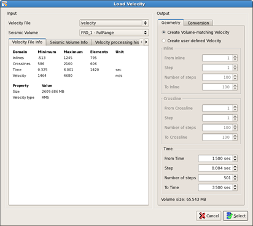
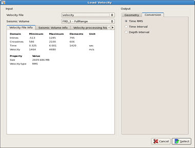
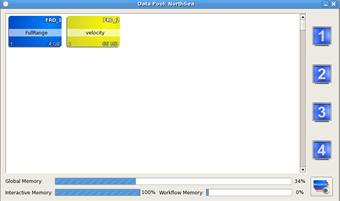

# Select velocity

To select a horizon go to **Project** → **Select Data** → **Select velocity**

The load velocity window opens.

_Load Velocity window_

In the input section the velocity file must be selected as well as an associated seismic volume.

The dimensions of the velocities must match the dimensions of the seismic volume that the user wants to use for an algorithm. This is always true for inline and crossline dimension and most of the time for the time/depth dimension.

This new way to deal with velocities is a significant improvement in terms of speed of processing, as not every trace has to be interpolated on the fly. By having the velocities data distributed the same way as the data allows to just access the needed trace instantly.

To select a volume-matching velocity, there is a special option available named "**Create Volume-matching Velocity**".

With this option, inline, crossline and time/depth dimension are set automatically to the volumes dimensions. In some cases, however, the velocity data might be needed with sampling starting at zero. That way the user can still adjust the time/depth range of the resulting velocity data.

**User-defined velocity**

Although every algorithm needs a matching velocity, it can be useful to select a user-defined one, e.g. at the original size. These selections can be visualized and several filters can be applied to it. After saving the filtered Velocity to disk, they are available for selection again and can be used in algorithms, later.

**Conversion**

Pre-Stack Pro supports conversion from RMS to interval velocity and vice versa. These options are available from the **"Conversion" Tab** in the parameter selection. This tab is available only if Select Velocity was opened from the menu. If it was opened from within an algorithm the algorithm will choose the necessary conversion parameters and the tab is hidden.

All information concerning the size, the range of the velocity and seismic data are available in the tabs in the central part of this window. In addition, the velocity processing history can be found in the last tab.

The velocity imported is then available in the data pool in yellow.

_Data pool velocity in yellow_

