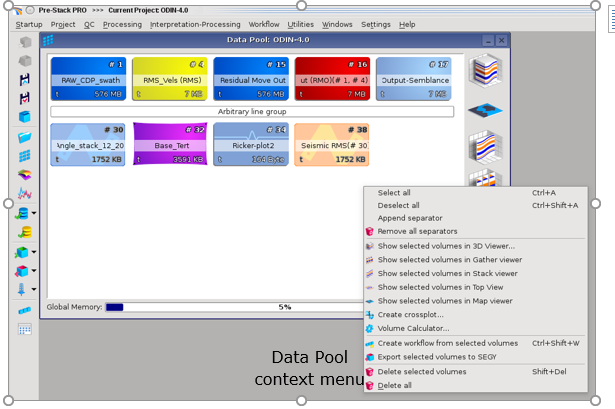
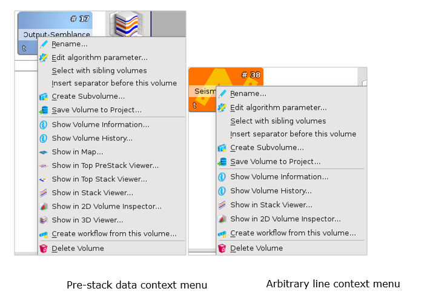
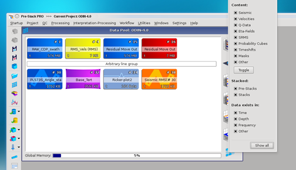

# Data Pool

_Data Pool overview_

The **Data Pool** window gives an overview of all loaded data:

* seismic volumes are in blue
* velocity data in yellow
* attenuation in green
* horizons in purple
* Eta data in red
* SRMS data in orange
* Time shifts in light blue.
* arbitrary line volumes have a zigzag
* wavelets have a wavelet motif

On the top of this window, the **name** of the project is visible. \(Eg ODIN-4.0 in this example\).

A separator bar can be inserted, and renamed to suit the subsequent data. This helps organize the data pool. In this example an arbitrary line group follows the initial seismic data. To insert a separator, invoke the context menu using the right mouse button and choose the corresponding entry. 

The global memory is shown at the bottom of this window. The used memory is given as percentage of the total available memory. The actual values are indicated by a tooltip when dragging the mouse cursor over the percentage bar. 

The local memory currently allocated at startup is also visible. This is useful to determine the maximum size of the volumes that can be displayed in the [3D VIewer](../../viewers/readme.2/).

Data volumes can be dragged into one of the six right hand side icons for visualization in a **Viewer Window**.

Using the data pool context menu, volumes can be selected as a group and displayed in an appropriate viewer. They can be input into Volume Calculator or into crossplot. They can also be used to create a workflow and exported to SEGY.

_Action on data volumes from the Data Pool_

Each data volume type has its own context menu. \(The arbitrary line menu is smaller than other volumes as it can’t be displayed in the 3D viewer\).

Individual data volumes can be QC’d by reading the volume information and history. They can be displayed in new viewer windows \(including the data comparator\). They can be renamed or saved to the project.

In addition, the data can be used to create a new dataset by editing a copy; by cutting a sub volume; or by generating a workflow of the processing sequence applied so far. This workflow can be applied to other volumes.

_Action on a volume from the Data Pool_

The data volumes can be sorted by type by using the filter option on the bottom right part of the tab.

_Sort out option in the Data Pool_

