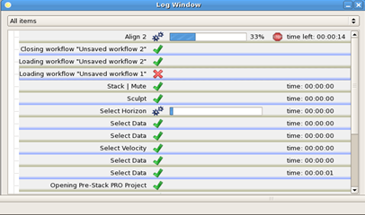

# Log Window

_Log window_

The **Log Window** gives a report about past and running processes of the current Pre-Stack Pro session. Running processes may also be halted from the log window by pressing the stop option on the right side of the running process.

