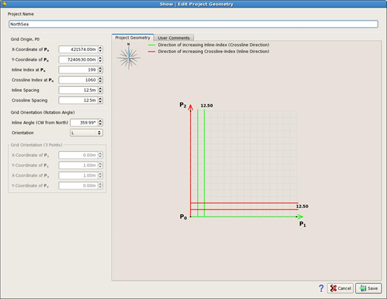

# Edit project geometry

If modifications are needed in the project geometry please [open the project](open_project.md).

Then go to **Project** → **edit project geometry**.

The Show\| edit project geometry will open and modification can be done. This window is very similar to the one discussed in the chapter [create project](../create_a_new_project.md).

_Show\| edit project geometry_

