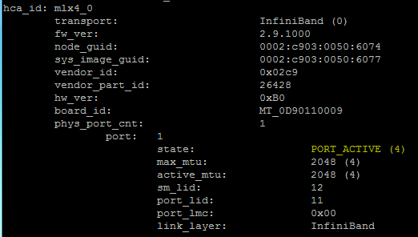

# Test the Infiniband connection

Try to do a ping from one machine to the interface of the other machine.

Run the command “ibv\_devinfo”; in the output the state of the ports where a cable is connected should be “ACTIVE”; if that is not the case please verify that:

* The cable is plugged in correctly 
* The subnet manager is started on at least one node _ibv\_devinfo_



Edit the file /etc/hosts and add all hosts and their respective IP addresses like the following example.

If you are using an internal DNS server this step might not be needed, if the DNS server is properly configured and reachable from all nodes.

File: /etc/hosts

```bash
127.0.0.1  localhost localhost.localdomain localhost4 localhost4.localdomain4
::1             localhost localhost.localdomain localhost6 localhost6.localdomain6
127.0.0.1  localhost.localdomain localhost
::1             localhost6.localdomain6 localhost6
192.168.10.10   node1
192.168.10.20   node2
192.168.80.10  node1-ib
192.168.80.20  node2-ib
```

