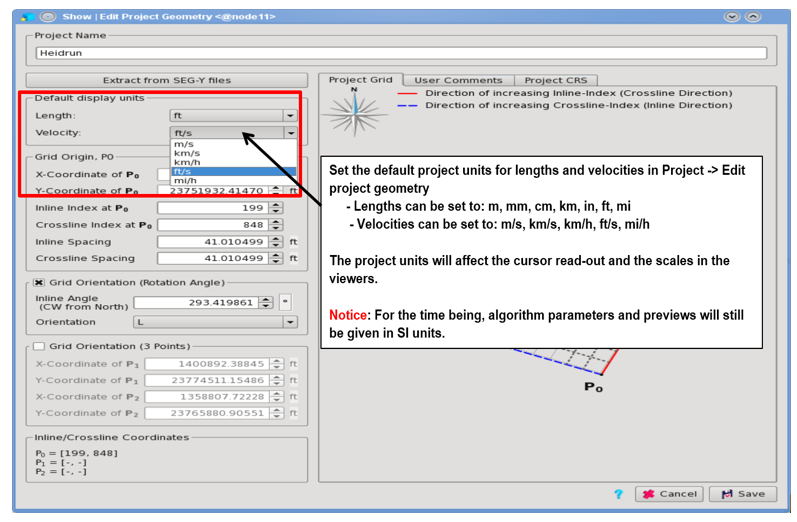
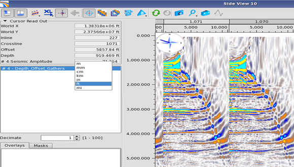
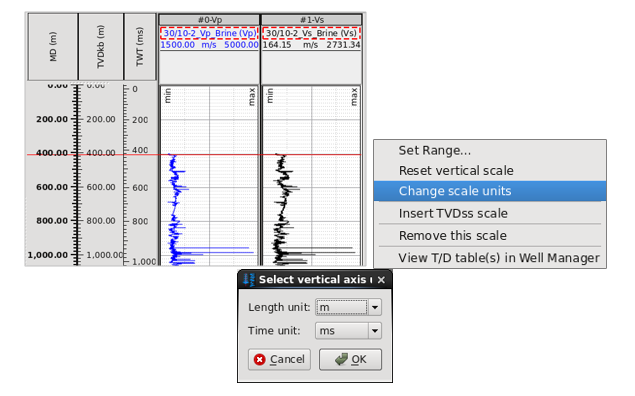

# Unit Support

Pre-Stack Pro supports both SI and imperial display units for all viewers, algorithm parameters and previews. Internal calculations will be carried out in SI units.

The user can select the default length and velocity display units when creating a new project or editing the project geometry.

Go to **Project** → **Create Project / Edit Project Geometry**

_Display unit default are available as part of the project geometry_

The time axis setup can be changed from seconds to milliseconds:

**Settings** → **Settings** → **Viewers** → **Display Units**

Both the project settings for distance and velocity, and the display settings for time will be used for all viewers in every project. All algorithm parameters, all histograms and statistics will respect these settings.

The read-out of viewer can be changed on the fly.

_Left click inside a readout field will open a menu to change its unit_

The well log viewer has separate length and time unit settings, which can be accessed by right clicking on the vertical axes.

W_ell log viewer unit settings_

