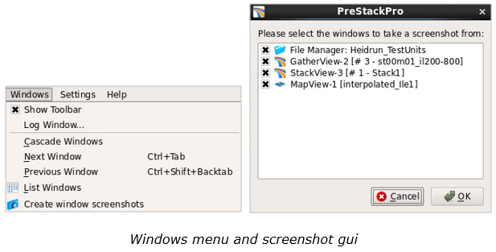
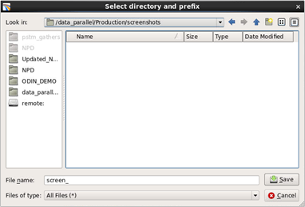

# Create Window Screenshots

It is possible to take screenshots of all Pre-Stack Pro display windows:

**Windows** → **Create window screenshots**.

If no windows are active, then a warning message will be given. Otherwise, all open windows will be selected by default. Deselect any item that you do not wish to copy, and then click OK.

Select the directory for the screenshots, and a prefix to be added to the screenshot file names.

**Specifying directory and prefix**

The filenames of the screenshots will start with the prefix followed by the window name \(for example “StackView-1”\) and a volume name related to an active volume in the window \(for example Partial\_Stack\_0\_40deg\). In this example the name of the screenshot file will be screen\_StackView-1\_Partial\_Stack\_0\_40deg.png.

File format for the screenshot files is Portable Network Graphics \(PNG\).

