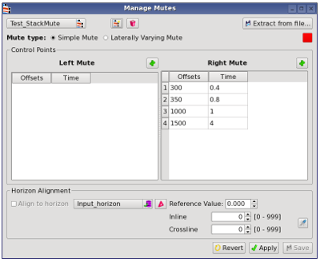
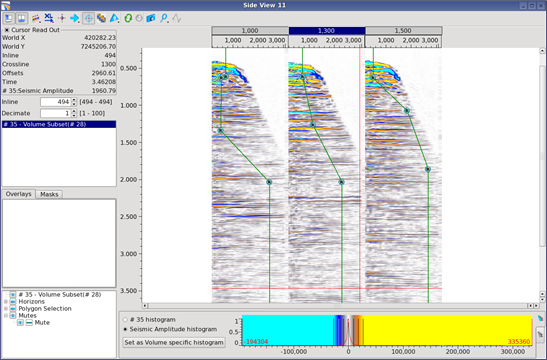

# Manage Mutes

Go to **Utilities --&gt; Manage Mutes**

Mute table can be created, edited and saved.

**Single mute:**

  
_Mute editor, single mute mode_

To edit the mute, double-click on a cell and type in the value you want. Clicking on the + icon will add a new control point. Click on Apply and then Save to save the mute to the project.

**Horizon alignment:**

Select a horizon and click on the  icon to load it in memory if necessary. Tick on the Align to horizon check box to tie the mute time to the horizon time.

**Laterally varying mute**:

The laterally varying mute gives the possibility to set spatially variant inner and outer mutes. Choose Laterally varying mute to enable that option. You can then add and type in directly the mute control point’s positions for the different inline/crossline key pairs.

To pick a laterally varying mute interactively, you can use the 2D Gather Viewer. Either choose an already existing mute or create a new one in the viewer \(right-click and choose Create Mute\). Right-clicking on the mute display will give you the option to enable Laterally Varying Mute. Then pick the mute at the locations of your choice. The mute will be interpolated between the locations.

_Laterally varying mute_

