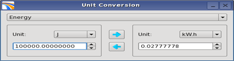

# Units Converter

Available in **Utilities** → **Units Converter** this small tool is for converting a given physical quantity between possible units of measurements.

  
_Units Converter_

The user choses in the list of available physical quantities and can convert any floating point number between two units measuring this same quantity.

