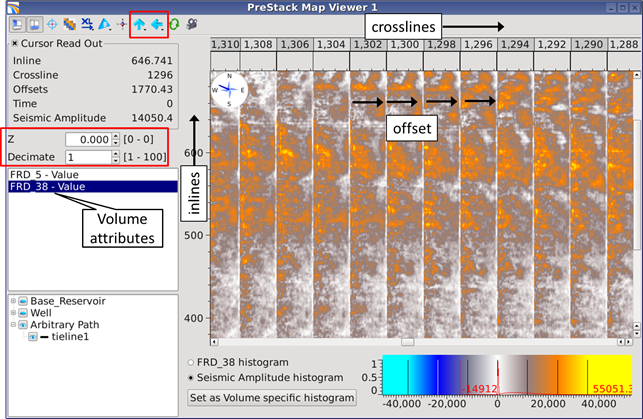

# 2D PreStack Map Viewer

The 2D Prestack Map Viewer allows the display of prestack attribute maps created from the [“create map” process](../algorithm_documentation/readme.4/readme.16/), with amplitude values shown for ALL offsets/angles. Timeslices from a seismic volume can also be viewed.

The functionalities of this viewer are quite similar to the one described for the map viewer. The axes \(inline/crossline\) have scrollbar functionalities. This helps the spatially scaling of the map \(offset vs. horizontal distance\). Decimating of the gathers is also convenient for keeping a sensible inline/crossline aspect ratio. In the toolbar there are additional blue arrows that enable flipping of inline/crossline axis.

_Amplitude map extracted along a horizon, in the pre-stack domain_

