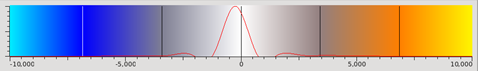
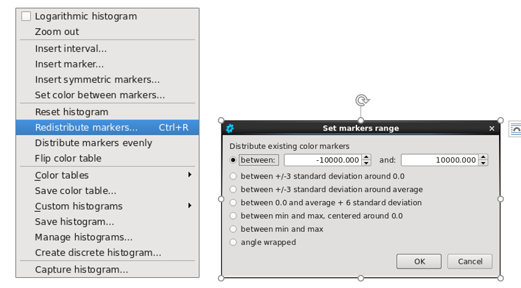
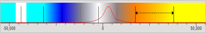
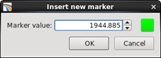
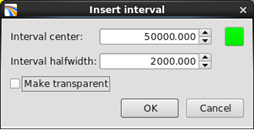
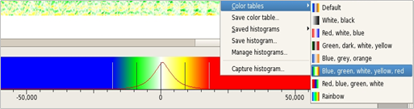
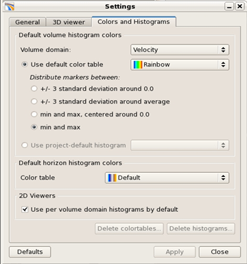

# Histograms

Histograms are displayed for all the main types of viewer. The colors are distributed between the left and right most markers.

_Color Histogram_

When a new viewer is opened, the corresponding histogram will be **content specific**: applicable to all datasets of that type. This can be changed to **volume specific**: applicable to that volume only.

The histogram has a wide range of editing functionalities. Many of these can be found by right clicking in the histogram to access its context menu.

**Redistribute markers** has multiple options for setting the display range of the histogram. Any changes take place immediately.

_Context menu and Redistribute markers_

It is possible to reset the histogram back to its original form using **Reset histogram**. The histogram can be copied from another viewer using **capture histograms**. The color table can be flipped \(so that negative values become positive and vice versa\) using **Flip color table**. **Distribute the markers evenly** will ensure equal spacing between markers. Histograms can be adjusted with the left and middle mouse buttons.

**Marker based editing**

The gain level can be tweaked by rolling the mouse wheel within the color bar. If the cursor is above one of the markers, then that marker will be used as the focal point. Otherwise, the colors will be expanded or compressed about the center of all the markers \(which is zero by default in most cases\).

It is possible to reposition the center away from zero by clicking the left or middle mouse button, and dragging the cursor.

Similarly, the horizontal axis view can be repositioned by clicking the left or middle mouse button over the axis and dragging the cursor. The mouse wheel can also be used to adjust the scale.

**Adjust interval**:

Holding down the control key takes you into **interval adjust** mode rather than marker based editing. A dashed arrow will indicate which interval to adjust. Markers can be repositioned within the interval by clicking control together the left mouse button, and then dragging the cursor.

_Interval selection_

**Insert a new marker:**

The user can insert new markers at arbitrary positions and define colors. This is done by right clicking on the color bar and selecting **Insert marker**. The marker position can be typed in manually.

_Insert new marker_

**Create an interval:**

An interval of constant colour can be added to the histogram by using the right hand mouse buttton menu option **Insert interval.** It opens the following tab. The interval below is colored green, centered at 50000, with a width of 4000.

_Insert Interval_

Constant color intervals can be edited or adjusted only in the **interval adjust** mode:

* control, right click to edit
* control, left click over the marker to drag
* control, rotate mouse wheel over the marker to expand

In addition, it is possible to **Insert symmetric markers**, wheretwo markers appear centered around a selected value. **Set color between markers** will fill a constant color between two markers.

**Create a discrete histogram:**

It is possible to create a discrete histogram with discrete colors. This might be useful for angle maps for example. The user can specify the minimum and maximum value you want to color-code and the number of colors. The colors will be created by clicking on Calculate.

**Saving and setting color tables and histograms:**

Saving is done via the \(right click\) context menu using the entries **Save color table** and **Save histogram**.

_Blue, green, white, yellow, red color table_

Color tables are saved per user, not per project. Histograms are saved on the backend, and stored per project.

A global default color table is used, unless otherwise specified using the **Manage Histograms** command. It is automatically scaled to match the data range in the viewer. You can override the global default by saving a histogram and setting it as the default \(per project\) for a given content \(seismic amplitude, velocity etc\). This option pops-up when you select **Save Histogram** in the context menu.

In the example below, all the velocity data types will have the same rainbow color table and distribution of markers by default. The color table can of course be edited within the viewers to fit your specific visualization requirements.

_Manage histogram tab_

