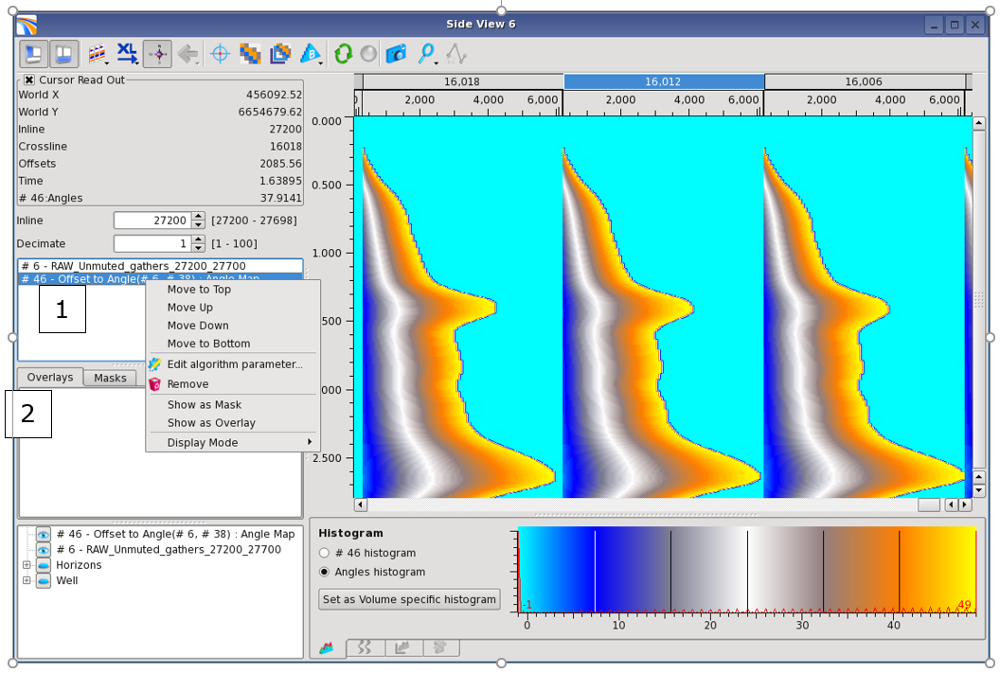
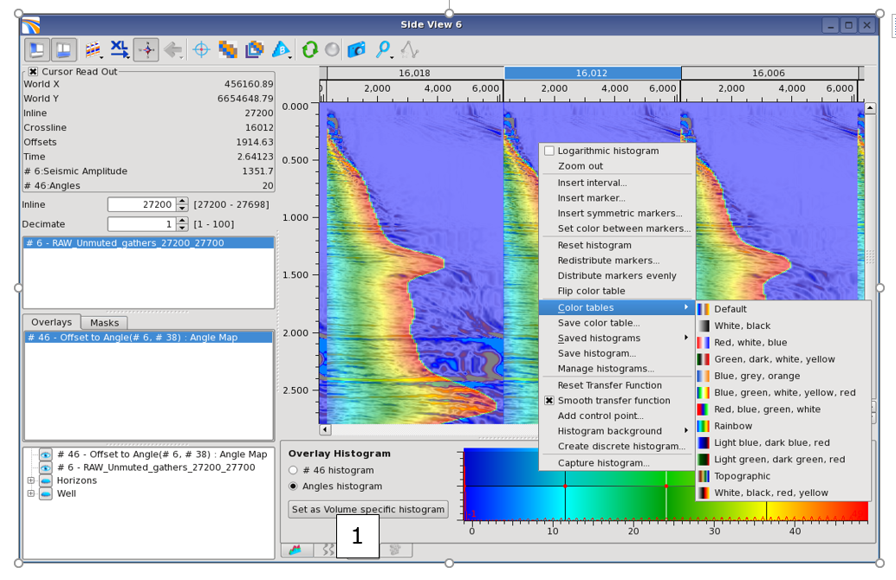
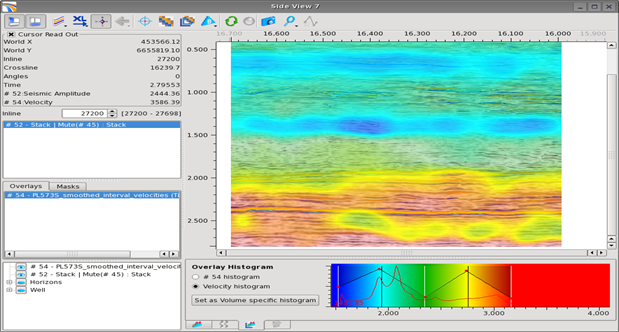
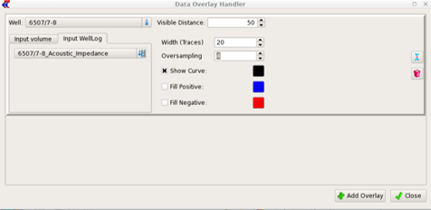

# Overlays

## Overlay of two volumes

You can overlay any dataset as a semi-transparent layer on top of any other dataset, having the same geometry, in any viewer, except the Map Viewer and the 3D Viewer.

You can select a volume to be an overlay either by \(1\) a right click mouse button when selecting the volume and choose to Show as overlay, or \(2\) a drag and drop of the volume into the overlay list.

This histogram of the overlaid volume is available by clicking \(1\) on the corresponding tab. You can modify independently of the other volumes the color table of the transparent volume, as well as the Transfer function to control the transparency. Using Ctrl + Mouse wheel will modify the overall transparency level or you can modify each point of the transfer function one by one. Alternatively, if ticking off “Smooth Transfer Function” in the menu, the function can be freely drawn by the user by pressing Ctrl+Mouse click.  

## Overlay of volumes or logs along a well path

Logs and other volumes \(for example a Zoepppritz synthetic or the results of inversion\) can be displayed along well path on the stack viewer. Several data can be overlaid on the same well path. 

In the section viewers and some tools \(like the Manual horizon picking\) the icon  opens the Data Overlay Handler. 

Once **Add Overlay** has been clicked, Volume \(must be available in the Data Pool\) or Well log \(only belonging to the selected well\) can be chosen. The right section are the [Visible distance](../../settings.md) setting and the [wiggle settings](../readme.7/display_data_as_wiggle_plot.md). Multiple overlays can be added on the same or different wells. 

