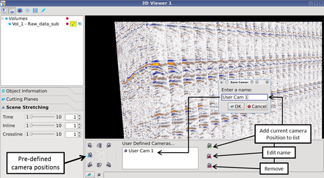

# Camera positions

A set of pre-defined scenes are available in the ‘Camera & Color bar’field. The user can in addition save any desirable scene as shown in the figure below. The scene can be saved to memory, but not to a file. To save any scene, click ‘Add current camera to user defined camera list’ Enter a name in the dialog and press ‘OK’. The name will then appear in the list next to the icons.

_Camera positions_

